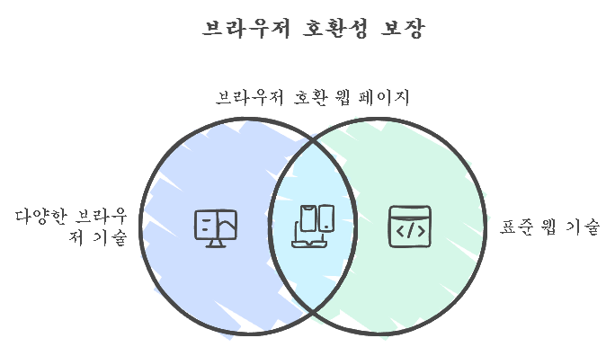
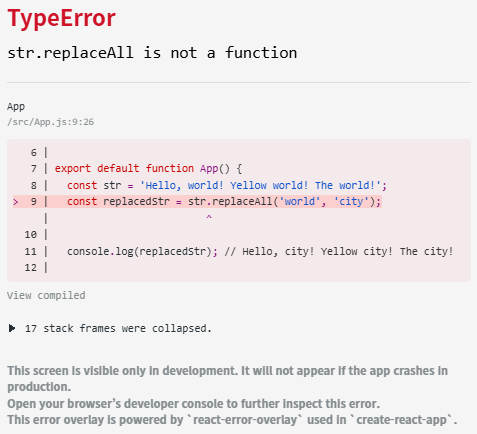
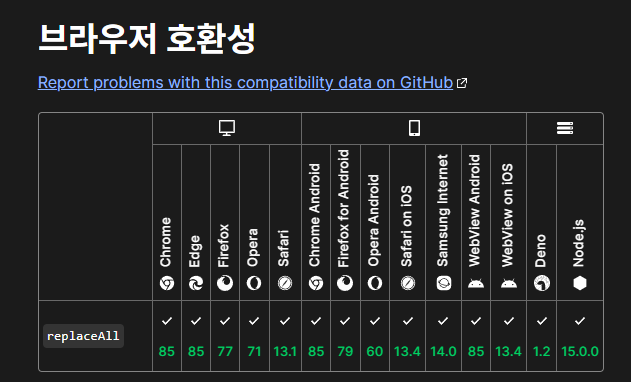

#### 크로스 브라우징이란 뭘까요?

이 용어에 대해 알기 전에는 크로스 브라우징을 들었을 때, 크로스 오리진 리소스 쉐어링(CORS)이 먼저 떠올랐었는데요. CORS가 오리진의 차이로 인해 발생하는 문제니까 크로스 브라우징도 브라우저 간의 차이로 인해 발생하는 문제일 것이라 생각했습니다.

그러나 자세히 들어가보면 크로스 브라우저가 아니라 크로스 브라우징이라는 단어가 사용되었는데요. 브라우징이란 단어를 한국정보통신기술협회에서 정의한 내용을 인용해보았습니다.

> 인터넷에 들어가 필요한 정보를 찾아내는 것.

이렇게 보면, Cross: 교차 + Browsing: 브라우징 = 인터넷에 들어가 필요한 정보를 교차 탐색하는 것이라고 생각할 수 있습니다. 그러나 실제로 크로스 브라우징은 이런 뜻이 아니기에 다시 한번 한국정보통신기술협회의 정보를 참고하였습니다.

> 여러 기종 혹은 플랫폼에 따라서 다르게 구현되어 있는 브라우징 기술들을 어느 한쪽에 치우치지 않고, 이들의 공통 요소와 표준 웹 기술을 기본으로 하여 모든 브라우저에서 통용될 수 있도록 웹 페이지를 제작하는 기법.



이렇듯 CORS 처럼 문제를 야기하는 것이 아닌, 위 사진처럼 **브라우저 호환성을 보장시키도록 하는 웹 페이지 제작 기법을 크로스 브라우징**이라고 합니다.

#### 실무에서 겪은 크로스 브라우징 이슈

제가 실무에서 경험한 이슈 중 replaceAll 메서드에 대하여 이야기하고자 합니다.
저는 어느때와 같이 일부 문자열의 변경을 위해 다음과 같이 코드를 작성하였습니다.

```typescript
const str = 'Hello, world! Yellow world! The world!';
const replacedStr = str.replaceAll('world', 'city');

console.log(replacedStr); // Hello, city! Yellow city! The city!
```

당연히 이 코드는 에러없이 정상적으로 동작했으며, 개발 서버 뿐만이 아니라 배포 이후에 QA를 거쳐 문제가 없다고 판단되었습니다. 그러나, 배포 이후에 시간이 지나고 iOS 13버전에서 전면 에러 팝업으로 인해 페이지가 마비되는 현상이 발생했습니다.

이 당시에 TypeError만 발생해도 에러 팝업이 발생하는데 프로덕션 환경에서는 해당 에러가 어디서 발생했는지 알 수 있는 방법이 없었습니다. 그래서 이슈 발생과 함께 빠르게 로컬 환경으로 접속하여 iOS 13버전에 해당하는 테스트 디바이스를 활용하여 디버깅을 진행하였습니다.



<div id="caption">
  캡처를 위해 prototype을 수정하여 크롬에서 띄운 화면입니다.
</div>

문제의 페이지에 진입하자마자 에러 팝업을 대신하여 리액트 개발 모드에서만 보이는 react-error-overlay가 등장하여 뭐가 어디서 어떻게 잘못되었는지 알 수 있었습니다.

그렇다면 replaceAll 메서드는 어떤 문제가 있었을까요? 바로 iOS 13버전에서는 replaceAll 메서드를 지원하지 않았기 때문입니다. 이는 어떻게 알 수 있었을까요?



<div id="caption">
  MDN Web Docs에서 replaceAll 메서드의 지원 브라우저를 확인한 결과입니다.
</div>

보통 JavaScript 내장 메서드에서 이런 에러가 발생하면 크로스 브라우징 이슈를 의심하게 됩니다. 저는 이런 경우 대부분 MDN Web Docs에서 해당 메서드의 지원 브라우저를 확인하곤 합니다. 사진을 보면 Safari on iOS는 13.4부터 지원하는 것을 볼 수 있네요.

여기서 나아가 iOS의 경우 [사파리 릴리즈 노트](https://developer.apple.com/documentation/safari-release-notes/safari-13_1-release_notes)를 보면 무슨 버전에서 문제 해결이 되었는지 정확한 확인이 가능합니다.

#### 해결

이 문제를 해결하기 위해서 다음과 같이 코드를 수정할 수 있습니다.

```typescript
const str = 'Hello, world! Yellow world! The world!';
const replacedStr = str.replace(/world/g, 'city');

console.log(replacedStr); // Hello, city! Yellow city! The city!
```

이렇게 수정하면 iOS 13버전에서도 정상적으로 동작하게 됩니다.
하지만 위와 같이 replace 메서드를 사용하면 해결은 할 수 있으나, 또 다른 문제가 발생하게 됩니다. 어떤 문제가 있을까요?

replaceAll 메서드는 종종 사용되기 떄문에 당장의 에러 해결을 위해 위와 같이 replace 메서드로 대체하게 된다면, 이후에 기억을 못한채로 replaceAll을 사용하면서 같은 이슈를 겪을 수도 있습니다. 또한, 협업하는 프론트엔드 개발자가 있으면 이를 모르고 사용하거나 새로운 폴리필을 추가하며 코드가 파편화 될 수도 있습니다.

그래서 이런 경우에는 core-js 라이브러리를 통해 폴리필을 추가하여 사용하는 것이 일반적이며 간편합니다.

```bash
npm install core-js
```

```typescript
import 'core-js/features/string/replace-all';
```

하지만 저는 replaceAll 메서드 하나를 위해 core-js를 추가하는 것은 리소스 낭비라고 생각하여 다음과 같이 폴리필을 추가하여 사용 중입니다.

```typescript
if (!String.prototype.replaceAll) {
  String.prototype.replaceAll = function (search: string, replace: string) {
    return this.split(search).join(replace);
  };
}
```

core-js 또는 String prototype 확장을 통해 폴리필을 추가하면 iOS 13.4 버전 미만에서도 replaceAll 메서드를 사용할 수 있게 됩니다.

#### 크로스 브라우징 대응에 대한 생각

보통 iOS 13같은 구버전의 OS 사용자는 많이 없다보니 개발 진행 중에는 문제가 생길 거라는 걸 알기가 쉽지 않아 그냥 JS 내장 메서드를 사용하곤 합니다. replaceAll 외에도 웹뷰의 포커스 체크를 위해 Web API인 visibilitychange 이벤트를 사용하려다 MDN Web Docs를 확인하니 사파리 14.5 버전 이상부터 지원한다는 것을 보고 놀랐던 기억이 있습니다.

뭔가 사용하기 불안하다 싶은 메서드나 이벤트가 있을 때는 MDN를 확인하고, 브라우저 호환성을 확인하는 습관을 들이는 것이 좋을 것 같습니다.

더 좋은 것은 크로스 브라우징을 위한 테스트 환경을 구축하여 테스트를 진행하는 것이라 생각합니다. 이를 통해 브라우저 호환성을 보장하고, 사용자에게 더 나은 경험을 제공할 수 있을 것입니다. 유닛, 통합 테스트를 거쳐 E2E 테스트까지 성공적으로 진행하기 위해 학습해야겠습니다.
