### Github Copilot

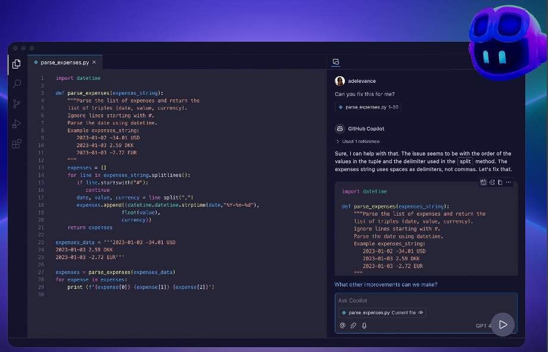
<div id="caption">출처: https://github.com/features/copilot</div>

프론트엔드 개발자로서 실무에서 1년 넘게 잘 사용 중인 깃허브 코파일럿이라는 저의 페어 프로그래머를 사용하게 된 계기와 실제로 어떻게 활용하고 있는지, 그리고 이를 사용하면서 얻은 경험을 공유하려고 합니다.


### 코파일럿 사용 계기

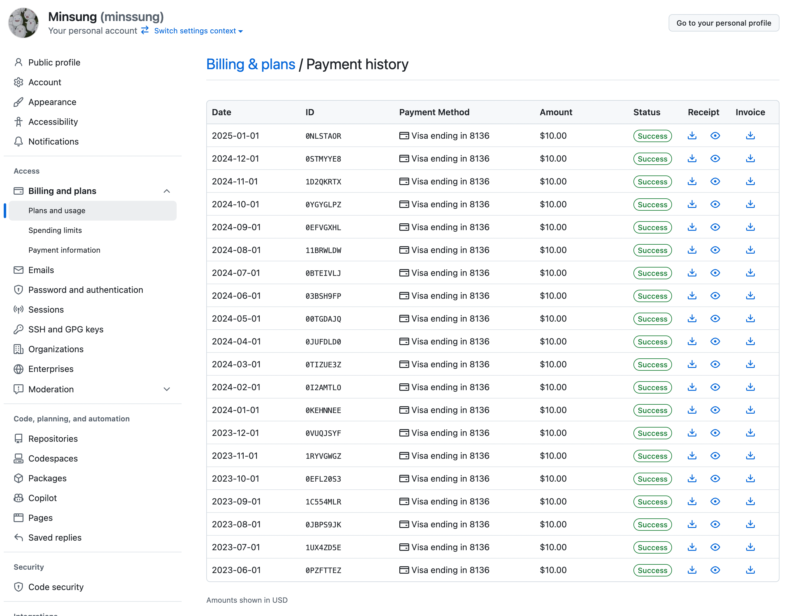
<div id="caption">코파일럿 결제 흔적</div>

지인의 추천으로 깃허브 코파일럿을 유료로 사용한 지 어느덧 1년 8개월이 지났습니다. 한 달 사용해 보고 마음에 안 들면 해지해야지 했었던 게 어제 같은데요.. 그간 사이드 프로젝트와 실무에서 다루면서 얻은 경험과 유용한 팁을 추가적으로 조사하여 정리해 보려고 합니다.

먼저 제가 코파일럿을 사용하는 이유는 생산성 향상 뿐만 아니라 나만의 작은 멘토로 둘 만큼, 제 부족한 역량을 뒷받침해주기 때문입니다. 지금이랑 처음에 사용했던 2023년 6월의 버전은 기능 차이는 꽤 나지만, 사용 방식 자체는 크게 변하지 않았습니다.

평소처럼 코드를 짤 때, 특히 웹 프론트는 반복되는 코드를 타이핑해야 하는 경우가 많은데 이 때 진가를 발휘 합니다. `React`에서 공통 컴포넌트로 `BottomSheet`를 구현하는 예시를 들어보겠습니다.

### 코파일럿으로 바텀시트 컴포넌트 구현하기

```tsx
// example) React Code

export const BottomSheet = () => {
 
 return (
  <div style={{ ... }}>
  
  </div>
 );
};
```

보통은 위와 같이 렌더링 구문에서 부모 앨리먼트의 스타일을 적용해야 좋을지 고민하게 됩니다.

하지만 코파일럿을 사용한다면?  
style을 입력하는 순간에 아래와 같이 자동으로 코드를 제안합니다.

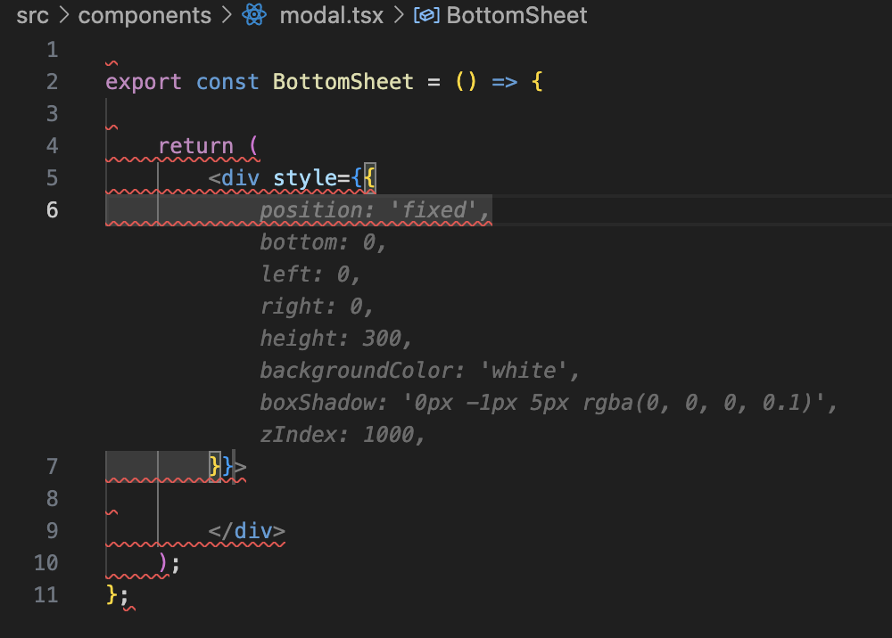
<div id="caption">코파일럿이 제안하는 Style 코드</div>

내가 사용하려던 코드라면 Tab 한 번으로 반영할 수 있습니다. 간혹 내가 원하는 방식이 아닐 경우에는 제안을 무시하고 다르게 구현 하다보면 그에 맞는 새로운 방식을 또 제안해 줍니다. 코파일럿의 버전이 올라가면서 코드의 흐름에 맞도록 제안 정확도가 지속적으로 발전하고 있습니다.

사실 위 예시는 그냥 ChatGPT나 Claude와 같은 생성형 AI에게 맡기면 컴포넌트 완전체를 바로 얻을 수도 있지만, 보통 이렇게 코파일럿이 제안하는 코드는 개발자들이 평균적으로 사용하는 코드(빅데이터)와 현재 내 코드 스타일을 섞어서 보여주다 보니, 현재 내 소스에 바로 적용할 수 있도록 호환성을 어느정도 보장해 주는 장점이 있습니다.

또한, 2024년에 릴리즈된 기능 중에 vscode의 extention으로 사용하는 Github Copilot으로 ChatGPT 처럼 코드 생성을 요청할 수도 있게 됐습니다. 이렇게 된다면, GPT에서 사용했던 완벽한 기능 구현 방식과 코파일럿에서 사용했던 프로젝트의 코드 스타일 최적화 기능이 결합되어 훨씬 더 편하고 쉽게 AI 이용이 가능합니다.

그렇다면 vscode 코파일럿 채팅으로 바텀시트 컴포넌트를 간단하게 구현해 보겠습니다.

먼저, 코파일럿에게 아래와 같이 프롬프팅 해보았습니다.

> 해당 컴포넌트를 다음과 같이 구현해 주세요.
> 
> 
> 컴포넌트는 title과 content를 앨리먼트로 받을 수 있어야 하고, X 버튼에 대한 close 이벤트를 콜백으로 받아야 합니다. 그리고 open과 close에 대한 컨트롤은 해당 컴포넌트를 사용하는 곳에서 제어가 가능해야 합니다.
>

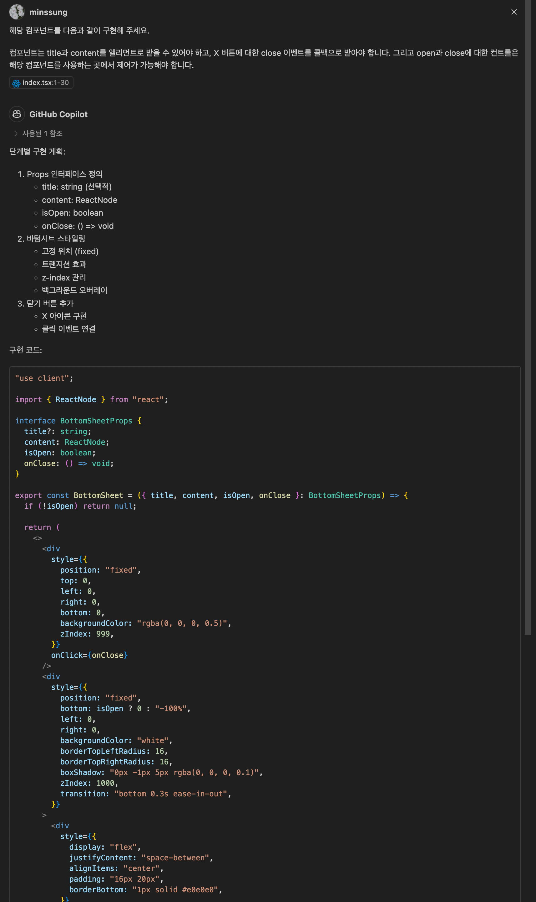
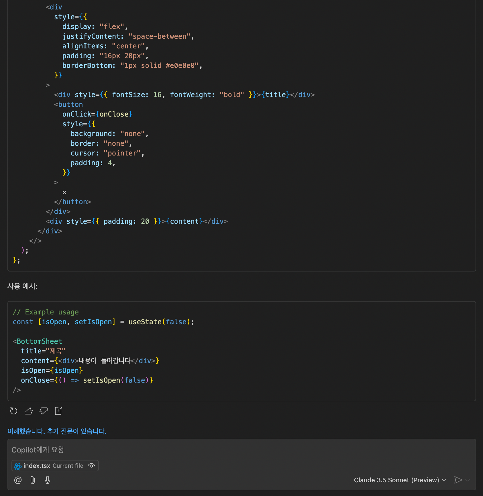

어떻게 구현되는지에 대해 기능별로 리스트업을 해주고, 구현 코드와 이에 따른 사용 예시를 보여주고 있습니다.

바로 컴포넌트를 페이지에 반영해서 테스트해봅니다.


제가 요구한대로는 문제가 없으나, 하나 문제가 생겼습니다.

코파일럿이 구현 계획에 남겨놓은 바텀시트 스타일링 중 트랜지션 효과가 적용되지 않았습니다. 이는 분명한 AI의 오류라고 볼 수 있는데 종종 발생합니다.. 요구사항은 아니었기에 무시해도 되지만, 있으면 더 부드러운 UX를 제공할 수 있기 때문에 추가로 코파일럿에게 요청해 봅니다.

**프롬프팅**

> 바텀시트 스타일링에서 트랜지션 효과가 발생하지 않습니다.
> 

이번에는 UI를 다르게 알려주는군요.. 아래는 코파일럿이 전달해 준 코드입니다.
```tsx
"use client";

import { ReactNode, useEffect, useState } from "react";

interface BottomSheetProps {
  title?: string;
  content: ReactNode;
  isOpen: boolean;
  onClose: () => void;
}

export const BottomSheet = ({
  title,
  content,
  isOpen,
  onClose,
}: BottomSheetProps) => {
  const [isShowing, setIsShowing] = useState(false);

  useEffect(() => {
    if (isOpen) {
      setIsShowing(true);
    } else {
      const timer = setTimeout(() => setIsShowing(false), 300);
      return () => clearTimeout(timer);
    }
  }, [isOpen]);

  if (!isShowing && !isOpen) return null;

  return (
    <>
      <div
        style={{
          position: "fixed",
          top: 0,
          left: 0,
          right: 0,
          bottom: 0,
          backgroundColor: "rgba(0, 0, 0, 0.5)",
          opacity: isOpen ? 1 : 0,
          transition: "opacity 0.3s ease-in-out",
          zIndex: 999,
        }}
        onClick={onClose}
      />
      <div
        style={{
          position: "fixed",
          left: 0,
          right: 0,
          bottom: 0,
          backgroundColor: "#fff",
          borderTopLeftRadius: "16px",
          borderTopRightRadius: "16px",
          transform: `translateY(${isOpen ? 0 : 100}%)`,
          transition: "transform 0.3s ease-in-out",
          zIndex: 1000,
        }}
      >
        <div
          style={{
            display: "flex",
            justifyContent: "space-between",
            alignItems: "center",
            padding: "16px 20px",
            borderBottom: "1px solid #e0e0e0",
          }}
        >
          <div style={{ fontSize: 16, fontWeight: "bold" }}>{title}</div>
          <button
            onClick={onClose}
            style={{
              background: "none",
              border: "none",
              cursor: "pointer",
              padding: 4,
            }}
          >
            ✕
          </button>
        </div>
        <div style={{ padding: 20 }}>{content}</div>
      </div>
    </>
  );
};

export default BottomSheet;

```

위 코드와 함께 주요 변경사항을 알려줍니다.

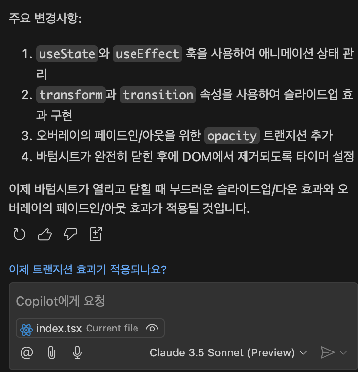

근데 여기서 코파일럿이 또 거짓말을 하네요. “바텀시트가 열리고 닫힐 때”라고 되어 있는데, 닫힐 때만 효과가 적용되었습니다.

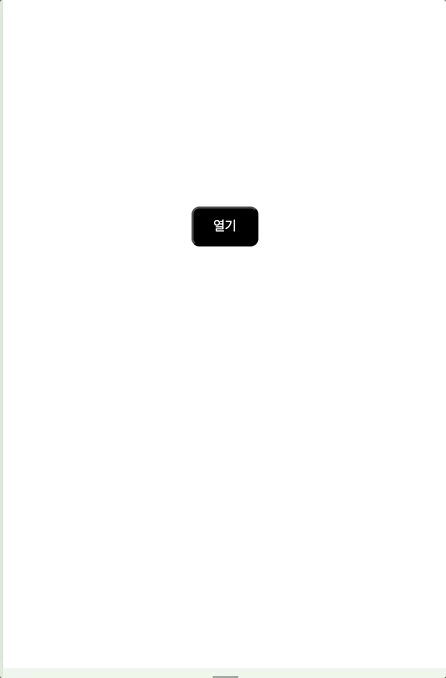
<div id="caption">gif 프레임 양해 말씀드립니다..</div>

한 번 더 요청하면 제가 최종적으로 원하는 컴포넌트가 탄생할 것 같습니다.

마지막으로 프롬프팅을 해봅니다.

> 바텀시트가 닫힐 때는 부드러운 효과가 적용되었지만,, 열릴 때는 아무 효과 없이 바로 노출됩니다.
>

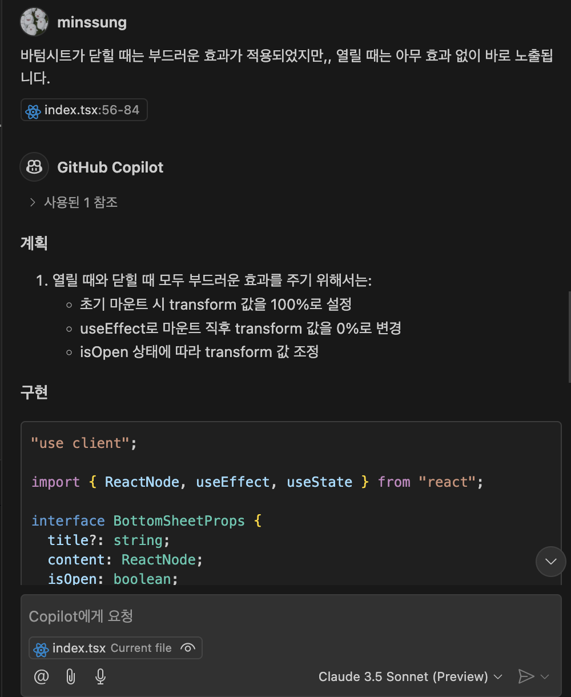

아래는 구현 코드입니다.

```tsx
"use client";

import { ReactNode, useEffect, useState } from "react";

interface BottomSheetProps {
  title?: string;
  content: ReactNode;
  isOpen: boolean;
  onClose: () => void;
}

export const BottomSheet = ({
  title,
  content,
  isOpen,
  onClose,
}: BottomSheetProps) => {
  const [isShowing, setIsShowing] = useState(false);
  const [isAnimating, setIsAnimating] = useState(false);

  useEffect(() => {
    if (isOpen) {
      setIsShowing(true);
      // 마운트 직후 애니메이션을 위한 지연
      requestAnimationFrame(() => {
        setIsAnimating(true);
      });
    } else {
      setIsAnimating(false);
      const timer = setTimeout(() => setIsShowing(false), 300);
      return () => clearTimeout(timer);
    }
  }, [isOpen]);

  if (!isShowing && !isOpen) return null;

  return (
    <>
      <div
        style={{
          position: "fixed",
          top: 0,
          left: 0,
          right: 0,
          bottom: 0,
          backgroundColor: "rgba(0, 0, 0, 0.5)",
          opacity: isAnimating ? 1 : 0,
          transition: "opacity 0.3s ease-in-out",
          zIndex: 999,
        }}
        onClick={onClose}
      />
      <div
        style={{
          position: "fixed",
          left: 0,
          right: 0,
          bottom: 0,
          backgroundColor: "#fff",
          borderTopLeftRadius: "16px",
          borderTopRightRadius: "16px",
          transform: `translateY(${isAnimating ? 0 : 100}%)`,
          transition: "transform 0.3s ease-in-out",
          zIndex: 1000,
        }}
      >
        <div
          style={{
            display: "flex",
            justifyContent: "space-between",
            alignItems: "center",
            padding: "16px 20px",
            borderBottom: "1px solid #e0e0e0",
          }}
        >
          <div style={{ fontSize: 16, fontWeight: "bold" }}>{title}</div>
          <button
            onClick={onClose}
            style={{
              background: "none",
              border: "none",
              cursor: "pointer",
              padding: 4,
            }}
          >
            ✕
          </button>
        </div>
        <div style={{ padding: 20 }}>{content}</div>
      </div>
    </>
  );
};
```

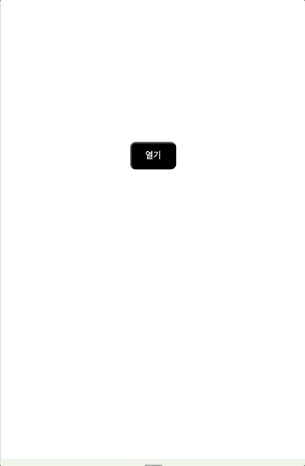

전달받은 코드를 그대로 반영하여 테스트해보았더니 잘 동작하는군요!

코파일럿의 코드 변경을 확인해 보면, `isAnimating` 상태가 추가되고, `requestAnimationFrame`도 활용된 것을 볼 수 있습니다. 그런데 여기서 `requestAnimationFrame`는 정확히 어떤 역할을 하는 이벤트일까요? 잘 모르고 있다면 이에 대해 찾아봐야겠죠. 여기서 코파일럿의 장점을 하나 더 발견할 수 있습니다.

어떤 기능을 하는지 궁금한 코드를 드래그한 상태로 우클릭 → Copilot → 설명을 클릭합니다.

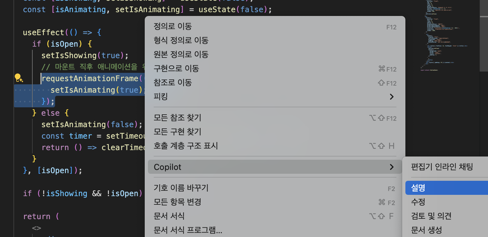

그럼 위 GUI에서 클릭한 것이 예약어 프롬프팅으로 자동 변경되어 코파일럿 챗에 입력되고 코드를 자세히 설명해 줍니다.  
(예약어 프롬프팅: `@workspace /explain Write an explanation for the active selection as paragraphs of text.`)

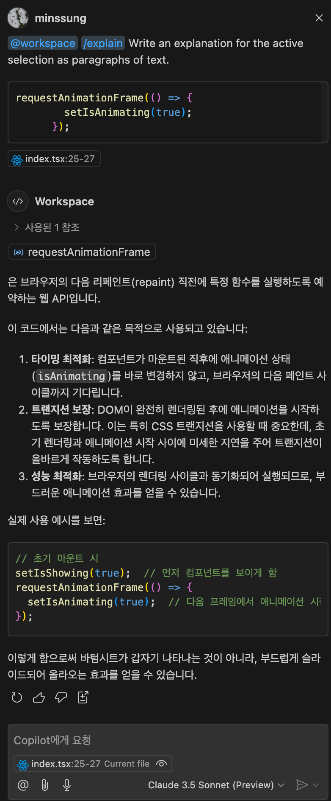

따로 구글링이나 AI에게 물어보는 것보다 더 간단하게 궁금함을 해소할 수 있습니다. 저는 여기서 더 나아가, `requestAnimationFrame API`를 제외하고 돌려보았는데 그래도 트랜지션이 잘 동작해서 한 번 더 코파일럿에게 물어봤네요.

### 마무리

vscode에 코파일럿 챗이 생기고 나서는 ChatGPT에게 별도로 물어보는 경우가 많이 줄은 것 같습니다. 원래는 코파일럿 챗이 GPT 4o 모델만 지원했었지만, 지금은 o1(preview), o1-mini(preview), Claude 3.5 Sonnet(preview) 까지 지원하기 때문에 응답 퀄리티가 정말 괜찮은 것 같아요.

언제까지 코파일럿으로 GPT를 대체할 수 있을지는 모르겠지만, 당분간은 충분하다고 생각합니다. 그리고 요새 발빠르게 변화하는 AI 시대에서 앞으로 프론트엔드 개발자라면, 이러한 AI 도구를 적절히 활용하는 것이 필수적이라고 생각합니다.

혹시라도 코파일럿을 사용하고 싶은데, 아직 사용해보지 않았다면 한 번 사용해보시길 추천드리고, 이외에도 FE가 활용하기 좋은 도구 및 팁이 있다면 공유해 주시면 감사하겠습니다!