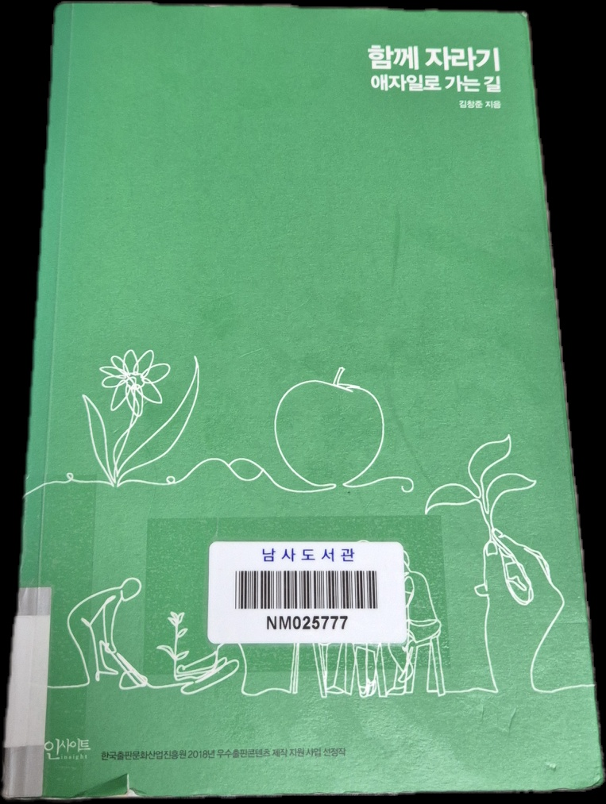
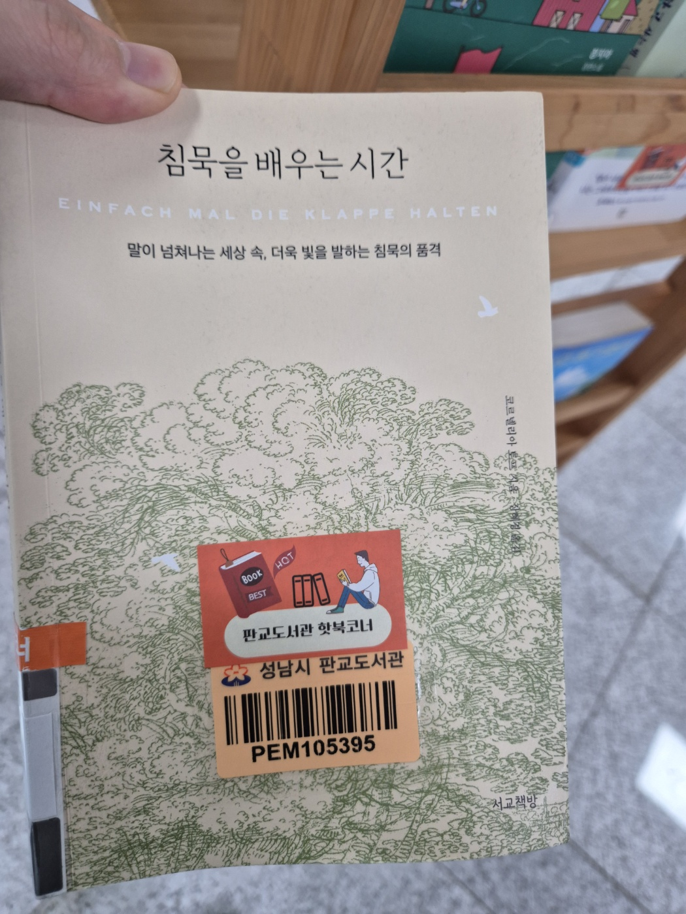

> 본 글은 경험을 부드럽게 잇기 위해 평어로 작성되어 있습니다.

### 목차

- [이 책을 읽게 된 배경](#이-책을-읽게-된-배경)
- [함께 자라기란 무엇일까](#함께-자라기란-무엇일까)
- [기억에 남는 3가지 제목](#기억에-남는-3가지-제목)
- [읽으면서 생각해본 Action Items](#읽으면서-생각해본-Action-Items)

---
### 이 책을 읽게 된 배경 

나는 평소에 자기계발 관련 책 또는 영상에 관심이 많다. 요즘에는 유튜브 보는 시간이 많이 줄어 잘 안보지만, 한창 이런 분야의 영상을 위주로 챙겨봤을 때는 알고리즘도 이에 최적화되어 관련 영상들만 메인에 노출되기도 했다.

평소에 유튜브 채널 구독을 잘 안하는 편이어서 어떤 영상을 봤냐 물어본다면 다 기억하진 못하지만, 그 중에서 놀면서 배우는 심리학, 줄여서 ‘놀심’ 채널의 영상이 주로 내게 유익하고 흥미로운 주제여서 이쪽 분야에서는 유일하게 구독이 되어있다.

영상이 아닌 책의 경우에는 최근에 한 권의 책을 40분만에 독서를 끝냈었다. 출근 후 점심시간에 갑자기 도서관이 가고 싶어서 근처 도서관으로 가서 읽고 싶은 책을 골라 제자리에 서서 쭉 읽어냈다.

책의 제목은 ‘침묵을 배우는 시간’으로, ‘말이 넘쳐나는 세상 속, 더욱 빛을 발하는 침묵의 품격’이라는 말로 독자를 이끌어 내고 있었다. 이 책을 한 줄로 요약해 보자면, 침묵도 의사소통 기법 중 하나라는 것이다. 상대방과 상호 간 대화를 나눌 때, 무조건 말로 소통을 잇는 게 아니라, 대화의 흐름에 따라 말대신 침묵을 통해 내게 더 유리한 방식으로 이끌어 갈 수 있다는 것이다. 앞의 예시는 보통 협상 의사소통에 해당한다.

서론이 길어졌는데, 함께 자라기라는 책을 단순히 누군가에게 추천받아서 보는 것이 아닌, 내가 진정히 필요로 하고 흥미를 갖고있는 주제임을 밝히기 위해서 최근에 내가 보고 느꼈던 일화를 적어보았다. 그럼, 이제 정말로 함께 자라는 것에 대해 생각해 보겠다.

### 함께 자라기란 무엇일까 

‘함께 자라기’라는 말은 여러 의미로 쓰일 수 있다. 유년 시절을 함께 보낸 친구와의 육체적 성장, 숲에 있는 수많은 나무들의 생장, 그리고 어딘가의 팀에서 소프트 스킬을 통한 팀의 성장 등 말이다. 이 중 김창준 저자의 ‘함께 자라기 애자일로 가는길’은 세 번째 성장에 포커스되어 쓰여진 책으로 볼 수 있다.

나는 책을 볼 때, 앞과 뒤의 겉표지를 먼저 보는 편이다. 앞에는 사람들이 함께 일하며 결실을 거두는 그림이 그려져 있고, 뒷 표지에는 아래와 같은 9개의 질문지가 쓰여져있다.

> 다음 문장들을 보고 거짓이라고 생각하는 게 있으면 골라보세요.
>
> 1. 일반적으로 경력이 많으면 전문성도 높다.
> 2. 수십 년간 같은 수련을 날마다 반복하면 실력이 는다.
> 3. 실수는 최대한 예방하는 것이 좋고 그것이 가능하다.
> 4. 업무 중 공유를 하면 신뢰가 쌓인다.
> 5. 전문가들은 문제를 풀 때 하향식 접근(문제 이해, 분석, 설계, 구현 등의 순서)을 한다.
> 6. 전문가들로 팀을 만들면 성공률이 높아진다.
> 7. 독립적으로 일하는 팀원들이 각자 높은 확률로 일을 마칠 수 있다고 말하면 우리 팀이 일을 제대로 마칠 확률도 높다.
> 8. 애자일로 성공하고 싶으면 작은 실천부터 시도하는 것이 좋다.
> 9. 더 좋은 방법론을 도입하면 우리의 성공률이 올라갈 것이다.
>
> 몇 개나 거짓으로 고르셨나요? 사실 위의 진술들은 모두 거짓입니다. 대부분 우리의 직관과는 반대입니다. 이 책을 통해 왜 각각이 미신인지, 그렇다면 우리는 어떻게 해야 할지를 배울 수 있을 겁니다.
>
> 이 책은 불확실한 상황에서 일해야 하는 사람이라면 누구에게나 도움이 될 것입니다. 전문성에 대한 미신을 깨고, 전문성을 키울 수 있는 제대로 된 방법을 알려줍니다. 애자일의 지엽적인 실천법과 도구에 집중하는 게 아니라 일하는 방법의 핵심과 통찰을 다루고 있습니다.

질문을 독자에게 던지고 이에 대한 해답을 책 속에서 찾을 수 있도록 유도하였다. 이 책을 읽기 전만 해도, 위 질문을 보았을 때 대부분 진실이라고 생각했었다. 그러나 책을 읽고 위 질문을 글로 정리하면서 답에 대해 다시 생각해 보니 놀랍게도 지금은 모두 거짓으로 보여진다.

위 같은 나의 변화로 미루어 보면, 내가 알고있던 애자일 개발 방법론을 적용하기 위한 행동들은 전부 허상이었던 것이다. 애자일이라는 뜻만 놓고보면 ‘개발과 함께 즉시 피드백을 받아서 유동적으로 개발’으로 정리되어 있으니 팀에 고수가 9할을 이룰 때 무조건적으로 더 낫지 않을까? 하는 오해를 할 수 있지만, 함께 자라기 위한 올바른 애자일 프로세스는 이러한 생각만큼 결코 단순하지 않았다.

‘함께 자라기’라는 제목의 뜻을 나는 이렇게 생각해 본다.

> ’함께 자라기 위해 필요한 나의 성장’

좋은 사람들과의 관계를 형성하기 위해서 본인 스스로 먼저 좋은 사람이 되어야 하듯, 좋은 팀원과 함께 하기 위해서 나를 성장시켜 팀과 동화될 수 있도록 한다.

### 기억에 남는 3가지 제목 

1. **자기계발은 복리로 돌아온다**

   자기계발은 복리로 돌아온다라는 말을 아직 체감하지는 못했지만 동기부여는 확실히 얻을 수 있었다. 동기부여는 어떻게 얻냐, 이 책은 대부분 근거가 명확한 자료를 인용하여 설명하기 때문에 독자에게 신뢰를 쌓아준다. 그렇게 복리로 돌아온다는 제목을 보고 일단 사실로 받아들이게 된다.
   
   특정 채용 플랫폼에서 2006년에 남녀 직장인 966명을 대상으로 조사한 직장인들의 자기계발 시간 통계를 보여주는데, 하루 평균 자기계발 시간이 1 ~ 2시간 정도가 54.1%로 가장 많았다. 그리고 2 ~ 3시간이 9.4%, 3시간 이상이 2.8%로 나타났다. 이 자료를 보고 사람들이 자기계발을 많이 한다는 느낌이 들면 반성해야 한다고 한다. 이 자료를 보고 놀란 나도 같이 반성했다..

   회고를 하는 것도 자기계발의 일환이다. 회고를 통해 자신의 성장을 돌아보고, 더 나아가 앞으로의 계획을 세울 수 있다. 2024년 처음으로 공식적인 회고를 진행했는데, 1년 뒤의 2025년의 내 연말 회고가 기대된다. 1년 전의 나와 비교하여 얼마나 성장할 수 있을지 말이다.

   - 책을 많이 읽었다에 그치지 말고, 책을 읽고 어떻게 내 삶에 적용할 것인지 생각할 것.
   - 피드백을 자주 받아라. 일찍, 그리고 자주 실패하라. 실패에서 학습하라.

2. **실수는 예방하는 것이 아니라 관리하는 것이다**

    이 제목을 보고 '바람은 계산하는 것이 아니라 극복하는 것이다.'라는 말이 생각났는데 책에서도 이 말을 인용하였다. 실수 예방에 관심을 쏟을 필요가 없다. 오히려 애자일 프로세스를 통해 실수를 관리하는 방법을 배우는 것이 중요하다. 실수를 관리하는 방법을 배우면, 실수를 두려워하지 않게 되고, 더 많은 시도를 할 수 있게 된다.

    더 많은 시도를 하면 더 많은 경험을 쌓을 수 있고, 더 많은 경험을 쌓으면 더 많은 성장을 할 수 있다. 오히려 책에서는 예방함으로서 더 많은 실수를 할 수 있다고 한다.

3. **전문가팀이 실패하는 이유**

    전문가팀이라고 하면, 한 분야에 있어서 뛰어난 실력을 가진 사람들로 이루어진 팀을 떠올릴 수 있다. 그러나 책에서는 전문가들로만 이루어진 팀은 실패할 확률이 높다고 한다.
    모두가 그렇지는 않겠지만, 보통 전문가들은 어느정도 본인의 실력에 프라이드를 가지고 있을 것이다. 그러나 이런 프라이드가 팀의 성공을 막는 요인이 될 수 있다. 협력을 하는데에 있어서 중간 중간 공유가 되야하는 상황에 각 개인의 작업에 몰두하면서 결과가 오히려 비전문가팀보다 더 나쁘게 나온 실험이 있다.

    그래서 책에서는 다음과 같은 정리했다.

    - 전문가들팀이라고 잘하는 게 아님
    - 오히려 성과가 떨어질 수 있음
    - 정보 공유하고 협력을 자하기 위한 명시적인 도움이 필요
    - 소셜 스킬 등이 뛰어난 제너럴리스트가 있으면 도움이 됨

### 읽으면서 생각해본 Action Items 

- 1주일에 한 번씩 주말에 주중 있었던 실무에 대해 회고한다.
- 전문성을 기르기 위한 일
  - 일의 난이도를 스스로 조절한다. 일이 쉬우면 개발 시간을 줄여서 어렵게 하고, 어려우면 보조 도구(확장, AI 등)를 사용하여 더 쉽게 한다.
  - 오픈 소스를 보며 코드의 패턴을 파악하고, 나아가 자체적으로 기능을 추가하고 피드백을 받는다.
  - 전문가를 인터뷰한다. 단, 직접적으로 “이걸 잘하기 위해서 어떻게 해야할까요?”가 아니라 그의 경험을 들을 수 있도록 질문을 유도해야 한다.
- 커뮤니케이션 향상을 위해서 마이크로 인터랙션을 해야한다.
    - 가벼운 인사, 스몰토크 등 짧지만 빈번한 대화
- 협업에서 작업을 서로 공유할 때는 하나 공유나 최고 공유가 아니라, 복수 공유를 해야 서로의 신뢰도가 상승하고, 더 나은 성과를 얻을 수 있다.
    - 하나의 경우, 솔직한 피드백을 주지 못할 수 있기 때문
- 심리적 안전감이 높아야 더 높은 수준의 팀 학습이 가능해진다.
    - 심리적 안전감이란, 내 생각이나 의견, 질문, 걱정, 혹은 실수가 드러났을 때 처벌받거나 놀림받지 않을 거라는 믿음을 말한다.
    - 이러한 심리적 안전감을 높이기 위해서는 팀 토론 등 특별히 고안된 활동(gTeams exercise)을 해야 한다. 그러나 바로 이런 활동을 도입하면 안되고, 일상적으로 마이크로 인터랙션을 통해 변화를 주면서 신뢰를 쌓고 해야한다.