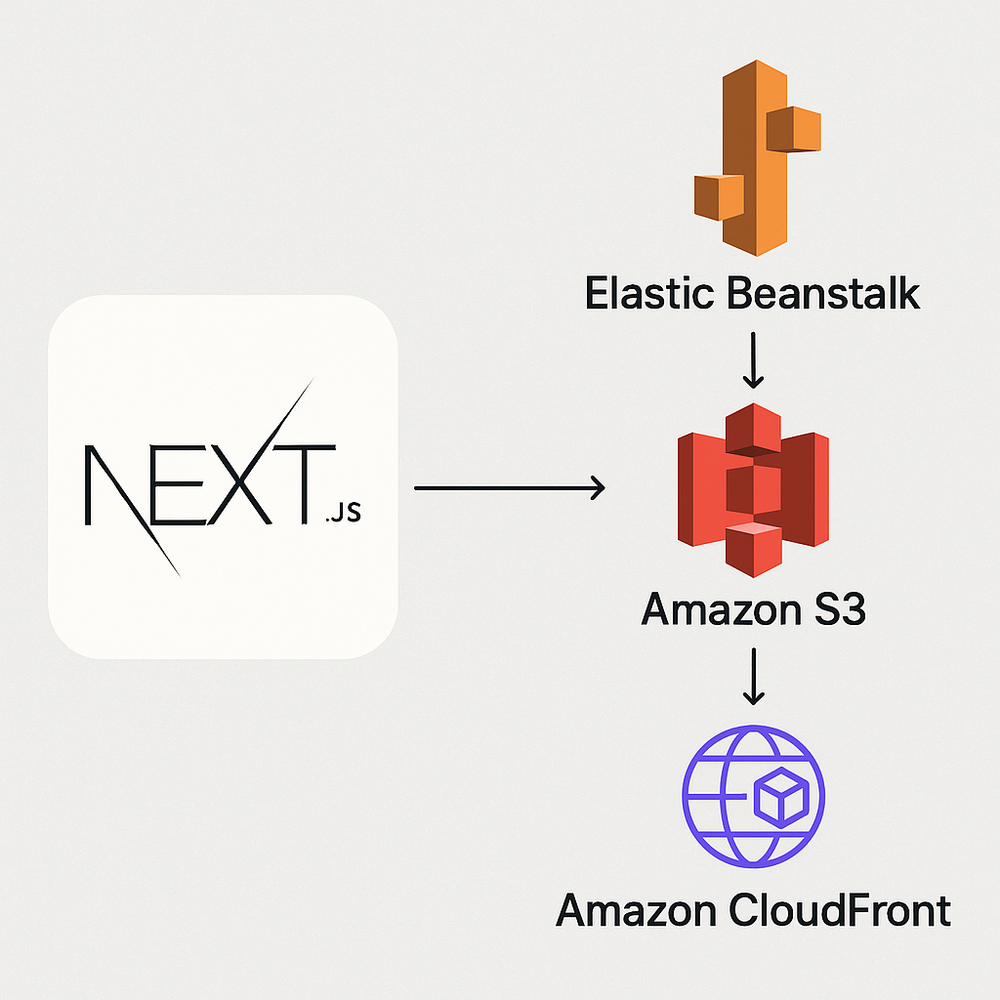
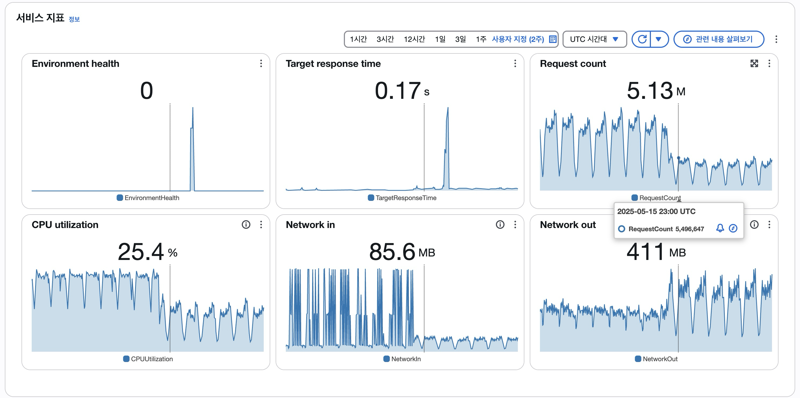

### 목차
- [개요](#개요)
- [빌드 폴더 구조](#빌드-폴더-구조)
- [next.config.js 설정](#next.config.js-설정)
  - [assetPrefix, standalone 설정](#assetprefix-standalone-설정)
- [CI/CD 설정](#ci-cd-설정)
  - [정적 파일을 S3에 업로드하기](#정적-파일을-s3에-업로드하기)
  - [번들 패키징](#번들-패키징)
  - [번들 파일을 S3에 업로드](#번들-파일을-s3에-업로드)
  - [EB 앱 버전 등록](#eb-앱-버전-등록)
  - [EB 환경 업데이트](#eb-환경-업데이트)
- [CloudFront 캐싱 설정](#cloudfront-캐싱-설정)
- [적용 2주 후 모니터링 결과](#적용-2주-후-모니터링-결과)
- [마무리](#마무리)
  - [한 줄이 아니게 된 트러블슈팅](#한-줄이-아니게-된-트러블슈팅)

### 개요 <a id="개요"></a>

실무에서 <b>EB(Elastic Beanstalk)</b>를 통해 배포를 하며 운영하던 중에 최근, 트래픽에 비해 비용이 많이 늘어났음을 클라우드 관리자님으로부터 전달받았습니다.

원인 파악을 서버 담당자분과 같이 해보았으나 확실하게 잡히는 부분이 보이지 않아 이와 별개로 비용 개선을 해야겠다는 생각으로 타사(바로 아래층) 프론트엔드 팀장님의 조언을 참고하여 이러한 방식을 도입했습니다.

이 글에서는 서버는 EB가 담당하고, 정적 파일은 S3 + CloudFront로 분리하여 서빙함으로써 성능과 비용을 최적화한 사례를 공유합니다. 내용을 이해하기엔 인프라와 Github Actions에 대한 기본적인 이해가 필요합니다.

### 빌드 폴더 구조 <a id="빌드-폴더-구조"></a>
Next.js 프로젝트에서 빌드 후 생성되는 폴더 구조는 다음과 같습니다:

```bash
├── .next/
│   ├── cache/
│   ├── server/
│   ├── standalone/
│   ├── static/
│   └── ...
├── public/
├── ...
```
**Next.js 13 이후**부터 `next.config.js`에 `output: 'standalone'`을 설정하면, 서버 실행에 필요한 최소한의 파일이 .next/standalone/에 구성되고, 정적 파일은 .next/static/에 저장됩니다.

- `.next/standalone/` : EB 서버로 배포되는 앱 런타임
- `.next/static/`: 정적 파일 → S3 + CloudFront로 분리 업로드

### next.config.js 설정 <a id="next.config.js-설정"></a>

#### assetPrefix, standalone 설정
`assetPrefix`를 설정하여 정적 파일을 S3 + CloudFront에서 서빙하도록 합니다. 이때, `NEXT_PUBLIC_GIT_COMMIT` 환경 변수를 사용하여 커밋 해시를 경로에 포함시킵니다.
``` js
// next.config.js
const commit = process.env.NEXT_PUBLIC_GIT_COMMIT || 'local';

module.exports = {
  output: 'standalone',
  assetPrefix: `https://xxx.cloudfront.net/${commit}`,
};
```

> 여기서 커밋 해시는 GitHub Actions에서 자동으로 설정됩니다. 이를 통해 정적 파일의 버전을 관리하고 캐시 무효화를 쉽게 처리할 수 있습니다.

### CI/CD 설정 <a id="ci-cd-설정"></a>

GitHub Actions에서 다음과 같은 순서로 워크플로우를 사용합니다:
(트리거나 install, build 등은 생략)

#### 정적 파일을 S3에 업로드하기 <a id="정적-파일을-s3에-업로드하기"></a>

```yaml
- name: Export commit hash
  run: echo "NEXT_PUBLIC_GIT_COMMIT=$(git rev-parse --short HEAD)" >> $GITHUB_ENV

- name: Upload static assets to S3
  run: aws s3 sync .next/static s3://my-bucket/static/$NEXT_PUBLIC_GIT_COMMIT --delete
```

배포할 때마다 캐시 무효화를 하기에는 번거롭기도 하고, 이전 버전의 파일이 S3에 남아있다면 **버전 롤백에도 용이하기 때문에 커밋 해시를 경로에 포함시켜 관리**합니다.

`public/` 폴더에 사용 중인 리소스가 많다면 `.next/static/` 폴더와 함께 S3에 업로드하기를 권장합니다.

#### 번들 패키징 <a id="번들-패키징"></a>

```yaml
- name: Package EB Bundle
  run: |
    mkdir -p eb_bundle
    cp -r .next node_modules package.json eb_bundle/
    cp -r public eb_bundle/.next/standalone/public
    echo "web: node .next/standalone/server.js" > eb_bundle/Procfile
    cd eb_bundle
    zip -r ../eb_bundle.zip .
```

EB 서버에서 실행할 수 있도록 `.next/standalone/` 디렉토리와 `Procfile`을 포함한 번들을 생성합니다.

저의 경우, public 폴더를 EB 서버에서 서빙하고 있어 `.next/standalone/public`에 복사합니다. 만약 S3로 정적 파일을 모두 서빙한다면 이 단계는 필요하지 않습니다.

**Procfile은 EB가 애플리케이션을 시작하는 방법을 정의합니다.** 여기서는 Node.js 서버를 실행하도록 설정합니다.

#### 번들 파일을 S3에 업로드 <a id="번들-파일을-s3에-업로드"></a>

```yaml
- name: Upload EB Bundle to S3
  run: aws s3 cp eb_bundle.zip s3://my-bucket/eb_bundle.zip
```

S3에 번들 파일을 업로드합니다. 이 파일은 EB에서 애플리케이션을 실행하는 데 사용됩니다.

#### EB 앱 버전 등록 <a id="eb-앱-버전-등록"></a>

```yaml
- name: Register EB Application Version
  run: |
    aws elasticbeanstalk create-application-version \
      --application-name my-app \
      --version-label $NEXT_PUBLIC_GIT_COMMIT \
      --source-bundle S3Bucket=my-bucket,S3Key=eb_bundle.zip
```

EB 애플리케이션 버전을 등록합니다. `NEXT_PUBLIC_GIT_COMMIT`을 버전 레이블로 사용하여 각 배포를 고유하게 식별할 수 있습니다.

#### EB 환경 업데이트 <a id="eb-환경-업데이트"></a>

```yaml
- name: Update EB Environment
  run: |
    aws elasticbeanstalk update-environment \
      --environment-name my-env \
      --version-label $NEXT_PUBLIC_GIT_COMMIT
```

EB 환경을 업데이트하여 새 버전을 배포합니다. 이때, `NEXT_PUBLIC_GIT_COMMIT`을 사용하여 최신 버전을 지정합니다.

### CloudFront 캐싱 설정 <a id="cloudfront-캐싱-설정"></a>

저의 경우, 이미 CloudFront를 사용 중이었기 때문에 S3 버킷만 연결했습니다.

만약 CloudFront를 처음 설정하는 경우, [AWS CloudFront 공식 문서](https://docs.aws.amazon.com/AmazonCloudFront/latest/DeveloperGuide/GettingStarted.html)를 참고하여 S3 버킷을 오리진으로 설정하고, 캐싱 정책을 구성합니다.
CloudFront에서 정적 파일을 캐싱할 때는 다음과 같은 설정을 권장합니다:
- **캐시 정책**: 정적 파일은 TTL(Time to Live)을 길게 설정하여 캐시를 오래 유지합니다. 예를 들어, 1개월 이상 설정할 수 있습니다.
- **오리진 요청 정책**: 정적 파일은 쿼리 스트링, 쿠키 등을 사용하지 않으므로, 오리진 요청 정책에서 이를 비활성화합니다.

공식 문서 대신 [[AWS] S3와 CloudFront 연동하기](https://velog.io/@rungoat/AWS-S3%EC%99%80-CloudFront-%EC%97%B0%EB%8F%99%ED%95%98%EA%B8%B0) 블로그 글도 좋습니다.

### 적용 2주 후 모니터링 결과 <a id="적용-2주-후-모니터링-결과"></a>

운영 환경에 적용한 지 2주가 지난 후, EB 콘솔 모니터링 결과는 다음과 같습니다:



- **Request count 2배 이상 감소**: 정적 요청을 EB 서버가 아닌 CloudFront로 분리 처리 → 서버 부하 감소
- **CPU utilization 2배 이상 감소**: 정적 파일 요청 부담 제거 → 서버는 SSR/API에 집중 → 인스턴스 스펙 최적화 가능
- **Network in 대폭 감소**: EB 서버로 유입되는 데이터량 감소 → 대역폭 비용 절감
- **Network out 2배 이상 증가**: 정적 파일 분리 후 EB는 SSR 요청 처리에 집중 → CloudFront를 통한 정적 파일 서빙으로 인한 증가

**전체적으로 서버 부하가 크게 감소하고, 정적 파일 요청이 CloudFront로 분리되어 성능이 향상**되었습니다. 또한, EB 인스턴스의 스펙을 낮춰도 충분히 운영 가능해졌습니다.

그런데 Network out이 증가한 이유가 뭘까 생각해 봤는데.. CloudFront를 통해 정적 파일을 서빙하면서 용량이 낮은 데이터는 CloudFront가 캐시하여 처리하지만, 용량이 큰 SSR 데이터는 여전히 EB 서버에서 처리하기 때문에 발생하는 현상으로 보입니다. (지표는 평균 값)

### 마무리 <a id="마무리"></a>

적용 과정이 쉽지 않았습니다. CI/CD 파이프라인을 통해 배포한 결과를 토대로 캐싱 처리를 확인해야 하는데 빌드 & 업로드 & 배포 시간이 건당 3분 이상 소요되기 때문에, 매번 워크플로우 실행 후에 확인까지 시간이 오래 걸렸습니다.

실제로 TEST와 STAGE 환경에서 워크플로우를 통한 배포가 안정화되기까지 여러 번의 시행착오를 거쳤습니다. 덕분에 PROD 환경에 적용할 때는 롤백할 준비와 함께 초집중 모니터링을 하며 배포를 진행했는데 다행히 첫 트라이에 성공했네요. 😅

진행하면서 제가 겪었던 문제와 해결 방법을 한 줄 트러블슈팅으로 정리하며 마무리 하겠습니다. 이 글이 비슷한 문제를 겪고 있는 분들에게 도움이 되길 바랍니다.

#### 한 줄이 아니게 된 트러블슈팅 <a id="한-줄이-아니게-된-트러블슈팅"></a>

- **문제**: `Module not found: Can't resolve '@components/layout'` 빌드 에러
  - **해결**: tsconfig.json에서 사용하던 alias를 `next.config.mjs`의 webpack 설정에 추가하여 해결.
  ```js
  // next.config.mjs
  const webpack = (config) => {
        const aliases = {
            '@define': 'src/define',
            '@globals': 'src/globals',
            '@providers': 'src/providers',
            '@components': 'src/components',
            '@contexts': 'src/contexts',
            '@modules': 'src/modules',
            '@widgets': 'src/widgets',
            '@state': 'src/state',
            '@hooks': 'src/hooks',
            '@api': 'src/app/api',
        };

        for (const [alias, target] of Object.entries(aliases)) {
            config.resolve.alias[alias] = path.join(__dirname, target);
        }

        return config;
    };
  ```
- **문제**: `ReferenceError: __dirname is not defined` 빌드 에러
  - **해결**: Next.js 13으로 마이그레이션 하면서 `next.config.js`를 `.mjs`(ESM 모듈)로 작성했는데 Node.js가 __dirname을 기본 제공하지 않아서 발생. 다음과 같이 import하여 해결.
  ```js
  import { dirname } from 'node:path';
  import { fileURLToPath } from 'node:url';

  const __dirname = dirname(fileURLToPath(import.meta.url));
  ```
- **문제**: `Error: Cannot find module 'tailwindcss'` 빌드 에러
  - **해결**: production 환경에서 `tailwindcss`가 설치되지 않아 발생. `package.json`에 `devDependencies`로 설정되어 있어, 프로덕션 빌드 시 설치되지 않음. 처음 설치 시에 개발 의존성도 설치하고, 이후에 개발 의존성은 다시 삭제.
  ```yml
  npm install --production=false

  npm prune --production # 개발 의존성 제거
  ```