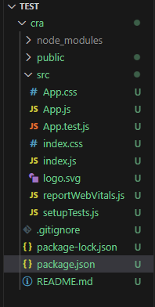
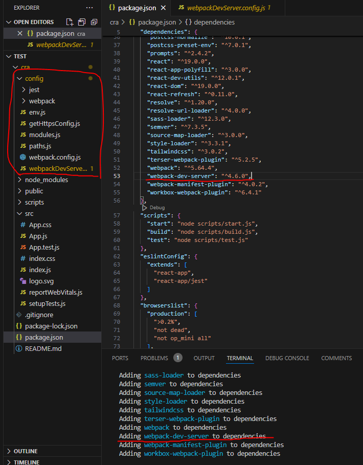
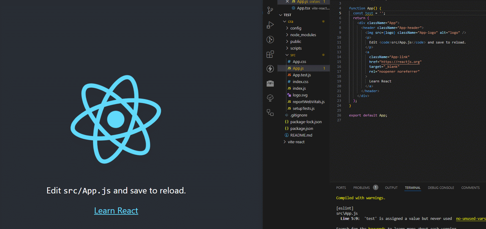
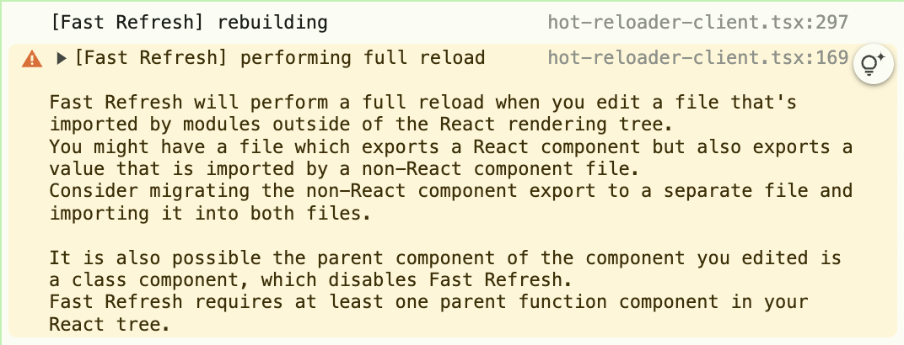

### 들어가며

_"Next.js를 다뤄온지 4년이 지나면서 그간 부족했던 부분이나 경험하지 못한 기능들을 다시 한번 정리하고자 "Next.js를 다루며" 시리즈의 첫 장을 작성하게 되었습니다."_

프론트단에서 개발을 하면서 <u>코드 변경이 일어날 때, 즉각적인 반영</u>이 중요한 순간이 많습니다. 특히, 저는 복잡한 상태를 가진 페이지에서 매번 새로고침 없이 빠르게 UI를 업데이트하는 것이 중요하다고 생각합니다. HMR이 예상대로 동작하지 않으면 개발 속도가 저하될 뿐만 아니라 디버깅 과정에서도 여러 불편함이 발생하게 되더군요.

프론트엔드 개발을 해보신 분들 중에서 **HMR**, **Hot Reload**, **Fast Refresh**라는 용어를 들어보셨을 수 있는데요. 이들이 조금씩 다르다는 점, 알고 계셨나요? 각각 어떻게 다른지, 그리고 실무에서 발생한 문제와 간단했던 해결 방법을 공유하려 합니다.

### 목차

- [코드 업데이트 기법](#코드-업데이트-기법)
- [HMR, Hot Reload, Fast Refresh 사례](#이들의-사례)
- [실무에서 겪은 HMR 문제](#실무에서-겪은-hmr-문제)
- [문제 해결](#문제-해결)
- [마무리하며](#마무리하며)

---

### 코드 업데이트 기법 <a id="코드-업데이트-기법"></a>

개념적으로 보면 코드 업데이트를 위한 여러 기술들이 있는데, 이 중에서 <b>HMR(Hot Moudle Replacement)</b>이 가장 기본적인 메커니즘입니다.

HMR이란? **모듈 단위로 코드를 교체하거나 추가할 때, 전체 페이지를 새로고침하지 않고 변경된 모듈만 교체하는 기능**을 말합니다. 이를 통해 개발자는 코드 수정 시 빠르게 반영되는 것을 확인할 수 있습니다.

이를 바탕으로, **Hot Reload**와 **Fast Refresh**는 **HMR**의 개념을 활용하거나 확장한 방식이라고 볼 수 있습니다.

다만, 엄격한 계층 구조라기보다는 <b>“HMR 기반 코드 업데이트”</b>라는 범주안에 속한 방식으로 이해할 수 있습니다.

이를 트리 구조로 표현하면 다음과 같이 나타낼 수 있습니다.

```plaintext
코드 업데이트 기법
│
├─ 전체 페이지 새로고침 (Full Reload)
│
└─ 모듈 단위 업데이트
    │
    └─ Hot Module Replacement (HMR)
         ├─ 기본 HMR
         ├─ Hot Reload
         │   └─ (HMR을 활용하지만, 구현에 따라 상태 보존이 미흡할 수도 있음)
         └─ Fast Refresh
             └─ (React/Next.js 최적화, 상태 보존 및 에러 복구)

```

위 구조에서 보듯이 Hot Reload와 Fast Refresh 모두 HMR의 개념을 활용하는 것으로 볼 수 있습니다.

### HMR, Hot Reload, Fast Refresh 사례 <a id="이들의-사례"></a>

#### HMR(Hot Module Replacement)

현재 전세계적으로 JavaScript에서 가장 많이 사용되고 있는 번들러인 Webpack에서도 HMR을 지원하고 있습니다.

> 최근 Vite가 Webpack을 따라잡는 추세인데 이러한 JavaScript 라이브러리 트랜드에 관심이 있으시다면 [Top JavaScript Tools and Libraries to Boost Web Development in 2025](https://hackernoon.com/vite-is-overtaking-webpack-as-developers-favorite-option-for-web-development)를 참고해 보세요!

Webpack의 플러그인 중에서 `webpack-dev-server`가 있는데, 보통 React를 CRA(Creat-React-App)로 설치할 경우 내부적으로 같이 설치됩니다. (React만 따로 설치하면 Webpack 구성이 안되어 있습니다..)

혹시나 CRA로 설치된 리액트 프로젝트에서 직접 Webpack 구성을 확인해 보려 하신다면, 일반적으로는 볼 수 없을 겁니다. 왜냐면 CRA는 기본 제공되는 라이브러리들을 모두 숨김 처리해두었기 때문이죠.

그래서 제가 **“webpack-dev-server는 어떻게 보는가?”** 에 대한 결과만 사진으로 보여드리겠습니다! 이 방법은 실제 웹팩 설정을 수정할 게 아니라면 할 필요가 전혀 없기 때문에…



위는 CRA로 React 앱을 설치하면 세팅되는 전체 디렉토리 구조입니다. 여기서 Webpack 세팅을 보고싶다! 하면 터미널에 `npm run eject` 스크립트를 입력하면 꽁꽁 숨어있던 Webpack이 아래 사진과 같이 모습을 드러냅니다.

__단, CRA로 설치된 프로젝트에서 eject를 하면 되돌릴 수 없으니 주의하셔야 합니다.__



root 경로에 config 디렉토리가 추가되고, `package.json`에 명시된 dependencies에는 온갖 라이브러리가 노출되게 되는데 빨간줄로 표시된 부분을 보시면 `webpack-dev-server`가 포함되어 있습니다.

그런데 Next.js는 어떨까요? 마지막 <u>Fast Refresh</u>에서 함께 다뤄보겠습니다.

#### Hot Reload

Hot Reload는 HMR을 기반으로 하지만, 기존 상태를 보존하는 방식이 보장되지 않습니다. 즉, 코드 변경 후 기존 상태가 유지되지 않고, 전체 컴포넌트가 다시 마운트될 수도 있습니다.
React 개발 환경에서 과거에 사용되던 [react-hot-loader](https://github.com/gaearon/react-hot-loader)가 대표적인 예시입니다.

이는 HMR 기능을 활용해 컴포넌트 변경 시 전체 리로드 없이 업데이트를 시도했지만, 때때로 컴포넌트의 내부 상태가 초기화되는 등의 한계가 있었습니다. 위 링크의 깃헙 페이지 마지막 커밋 날짜를 보면 3년 전으로, 현재는 사용하지 않는 것으로 볼 수 있겠네요.

#### Fast Refresh

Fast Refresh는 React와 Next.js에 특화된 HMR 방식으로, Hot Reload를 개선하여 상태 보존 및 에러 회복 기능을 강화한 방식입니다. 에러 회복 기능이란? 아래 GIF를 보면 알 수 있습니다.



<div id="caption">Fast Refresh를 통한 에러 회복</div>

코드를 수정하고 저장함과 동시에 에러가 발생하면, 위 화면처럼 **react error overlay**가 뜨면서 에러가 발생한 부분을 표시해줍니다. 여기서 에러를 수정하면, 자동으로 해당 컴포넌트만 리로드되어 수정된 내용이 반영됩니다.

**Next.js에서 사용되는 Fast Refresh 기능**은 React의 React Refresh 기술을 기반으로 하되, <u>Next.js 프레임워크에 최적화된 방식으로 통합된 하이브리드 구현체</u>입니다.

주요 차이점은 다음과 같습니다.

| 기능        | React Refresh      | Next.js Fast Refresh   |
| :---------- | :----------------- | :--------------------- |
| 적용 범위   | 모든 React 앱      | Next.js 앱 전용        |
| 설정 방식   | 수동 구성 필요     | 자동 활성화            |
| 파일 처리   | 기본 JS/CSS만 지원 | MDX, SCSS 등 확장 지원 |
| 환경 구성   | 직접 구현          | .env 파일 핫 리로드    |
| 에러 핸들링 | 기본 오버레이      | 향상된 디버깅 툴       |

또한, Next.js에서 웹팩을 수정하는 것이 CRA보다 훨씬 간편합니다. Next.js의 Webpack 설정을 직접 수정하려면 `next.config.js`에서 아래와 같이 설정할 수 있습니다.

```javascript
// next.config.js
module.exports = {
  webpack: (
    config,
    { buildId, dev, isServer, defaultLoaders, nextRuntime, webpack },
  ) => {
    // Important: return the modified config
    return config;
  },
};
```

위 코드는 [Next.js 웹팩 커스텀 공식문서](https://nextjs.org/docs/api-reference/next.config.js/custom-webpack-config)에서 가져온 예시이며, 공식문서에 자세한 설명이 있으니 구체적인 커스텀 가이드가 필요할 경우 참고하시면 좋을 것 같습니다.

Next.js 12.3 버전 이후로는 .env 파일 변경 시에도 핫 리로드가 가능하도록 확장되었으며, 이는 Next.js만의 독자적인 기능입니다. 따라서 **React의 핵심 기술을 기반으로 하되, Next.js의 아키텍처에 맞춘 추가 최적화가 적용된 기능**이라고 할 수 있습니다.

### 실무에서 겪은 HMR 문제 <a id="실무에서-겪은-hmr-문제"></a>

실무에서 겪은 문제로 Fast Refresh가 제대로 동작하지 않아 생산성에 큰 오류가 생긴 상태입니다. 지금은.. 코드 한 번 수정하면 해당 컴포넌트만 리렌더링되는 것이 아니라 페이지가 새로고침되어버리는 크나큰 이슈에 시달리는 상태 - -

이 문제는 기능적인 에러는 아니지만, 개발 생산성을 저해함과 동시에 콘솔에서 보기 싫은 경고 로그를 남기고 있습니다. 특정 컴포넌트에서 코드를 변경하고 웹 브라우저의 콘솔 창을 열어보면 다음과 같은 경고 메시지를 만날 때가 있습니다.



이 경고가 뜨면 웹이 새로고침되듯 Full Reload가 되어 버립니다.

전체 리로드 한다 해도 초기 진입 시간이 짧다면 문제가 없지만, 저희 프로젝트의 경우 진입과 동시에 캐싱 하지 않고 신규 데이터를 불러오는 상황이라 초기 진입 시간이 길어집니다. (비즈니스 상 이유로 캐싱을 사용하지 않고 있습니다.)

그래서 매번 코드를 수정할 때마다 Full Reload가 발생할 경우 짧게는 5초, 길게는 10초 이상의 시간이 소요되곤 합니다.


이전 사진은 웹 브라우저 상의 로그였다면, 이번에는 터미널 상의 로그입니다. 친절하게도 해결방법이 나와있는 링크를 제공해주고 있네요. **얼른 노란화면 그만보고 해결하러 떠나야겠습니다.**

### 문제 해결 <a id="문제-해결"></a>

해결하기 위해 가장 먼저 Next.js의 공식문서를 확인해보았습니다. [Next.js - Fast Refresh](https://nextjs.org/docs/architecture/fast-refresh)에 따르면, Fast Refresh는 Next.js 9.4 버전부터 기본적으로 활성화되어 있으며, 특별한 설정이 필요하지 않다고 합니다.

문서에서 소개하는 Fast Refresh가 발생하지 않는 제한 사항은 다음과 같습니다.

- 비 React 파일 수정 (예: `utils.js`, `config.js` 등)
- React 컴포넌트 외부에서 상태를 변경하는 경우 (예: `useState`를 사용하지 않는 경우)
- HMR이 불가능한 구조 (예: 익명 화살표 함수 사용 시)

위에서 세 번째 제한 사항이 문제의 원인이라고 판단하여, 해당 부분을 수정하였습니다.

```tsx
// Before
export default () => {
  const [count, setCount] = useState(0);
  return (
    <div>
      <p>{count}</p>
      <button onClick={() => setCount(count + 1)}>Click me</button>
    </div>
  );
};

// After
const App = () => {
  const [count, setCount] = useState(0);
  const handleClick = () => setCount(count + 1);
  return (
    <div>
      <p>{count}</p>
      <button onClick={handleClick}>Click me</button>
    </div>
  );
};

export default App;
```

익명 함수에 이름을 붙여주니 Full Reload가 발생하지 않더군요. 이렇게 초 간단이었다니..

이제는 코드 수정 시 페이지가 새로고침되지 않고, 수정된 컴포넌트만 리마운트되는 것을 확인할 수 있었습니다.

이로써 모두 해결한 것 같지만.. **진정한 Fast Refresh는 코드가 수정된 컴포넌트의 상태 또한 보존되어야 합니다.(즉, 리마운트되면 안됨)** 이 부분은 이번에 학습한 내용을 바탕으로 추가적인 조사와 수정을 진행해보려 합니다.

추가로, 공식 문서를 보다가 발견한 꽤 유용해 보이는 기능이 있어서 가져왔습니다.
Fast Refresh가 정상적으로 돌면 코드 수정에도 컴포넌트의 상태가 유지되게 되지만, 만약 애니메이션의 변화를 감지해야 한다면 리마운트되어야겠죠.

컴포넌트 내에 아래 주석을 추가하고 코드를 수정하면, 해당 컴포넌트는 항상 리마운트됩니다.

```tsx
// @refresh reset
```

### 마무리하며 <a id="마무리하며"></a>

UI 작업으로 인해 코드의 단순 변경이 잦은 프론트엔드의 특성상, HMR과 같은 기능은 필수적인 요소라고 생각합니다. **한 컴포넌트를 작업하는데 100번의 저장을 필요로 한다고 가정할 때, 갱신 시간이 1초가 걸린다면 100초, 7초가 걸린다면 700초가 소요됩니다. 600초는 10분이나 되는 시간이죠.**

10분이면 무엇을 할 수 있을지 궁금해서 찾아봤습니다.


<div id="caption">출처: 한국타잔님 유튜브</div>

왼쪽에 리스트업 된 게 10분으로 할 수 있는 것들이고, 오른쪽은 이를 1년 365일 동안 반복했을 때의 결과입니다. 10분이라는 시간이 얼마나 소중한지 체감이 되네요..

이번 글을 통해, 다시 한번 개발 생산성의 중요성을 느끼게 되었습니다. 이런 HMR 기법 외에도 복잡한 렌더링이 발생하는 페이지에서는 로딩하는 과정에서의 시간을 줄이는 것도 중요할 것 같습니다. (특히나 프로덕션 환경과 다르게 로컬 환경에서는 더욱 느리니까요)

이렇게 "Next.js를 다루며" 첫 장을 줄이고, 다음에 정리하게 될 Next를 스스로 기대하며 마무리 지어봅니다.

---

#### 참고 자료

- https://blog.logrocket.com/7-common-next-js-hmr-issues/
- https://dev.to/writech/how-to-enable-hot-reloading-for-env-files-in-nextjs-3026
- https://www.youtube.com/watch?v=JAjcvSFDrgs
