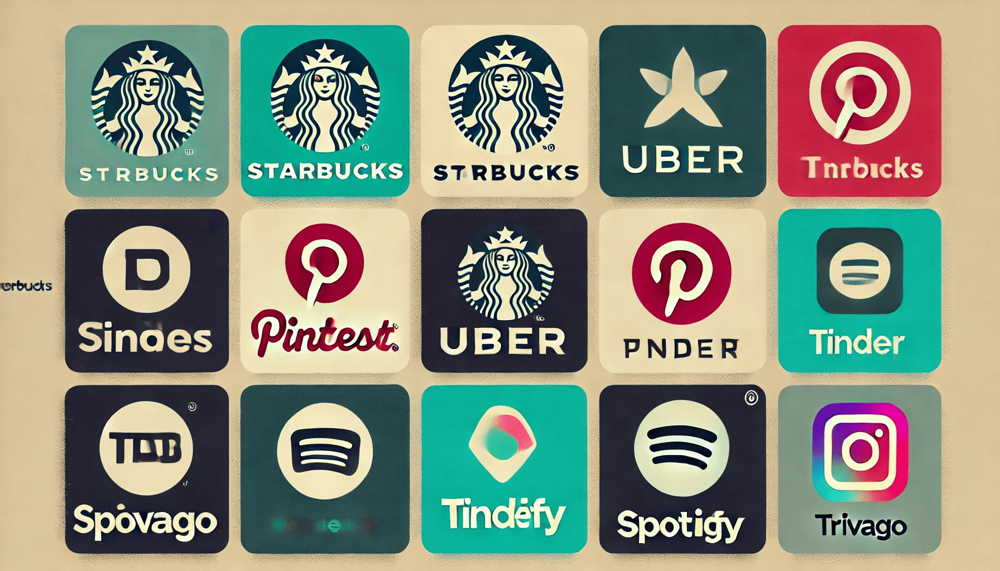
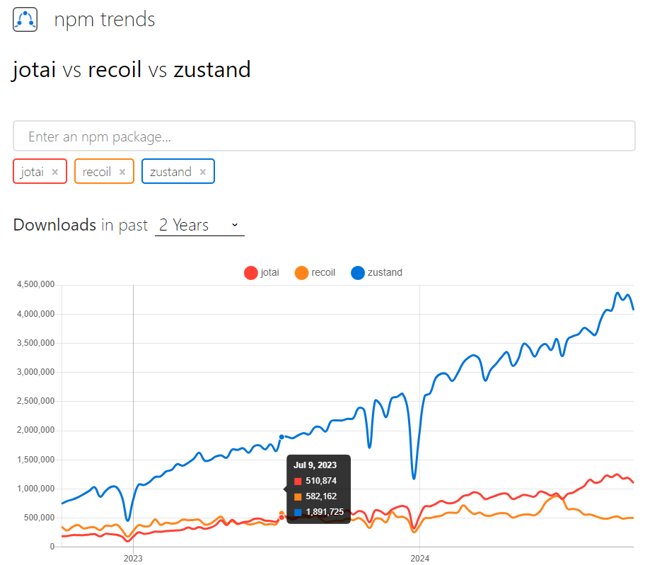
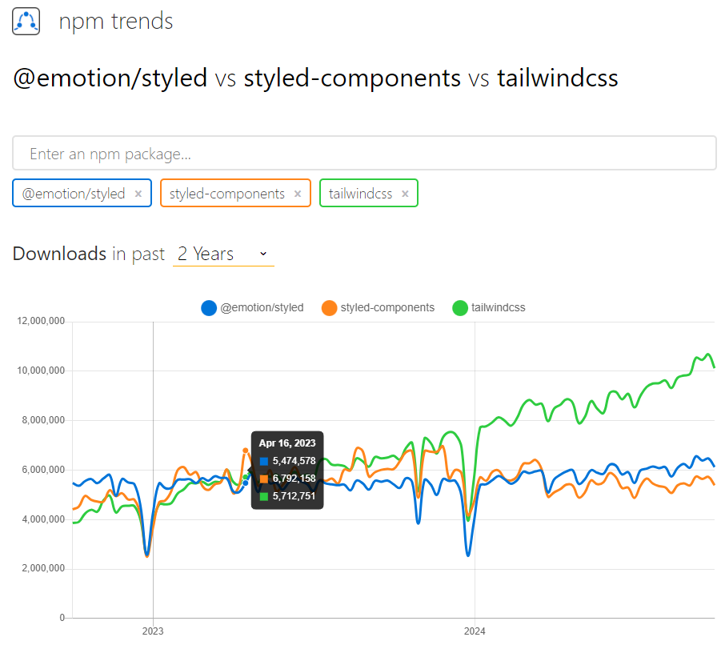
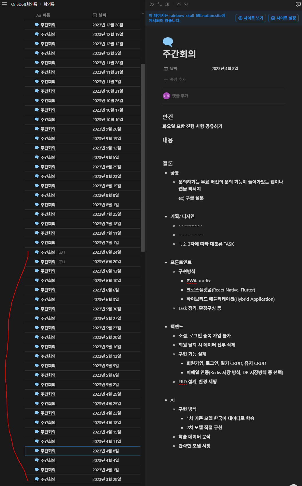
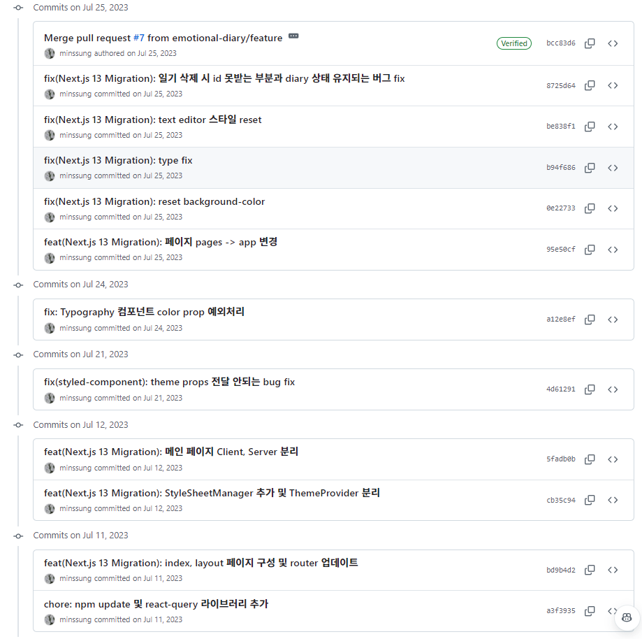
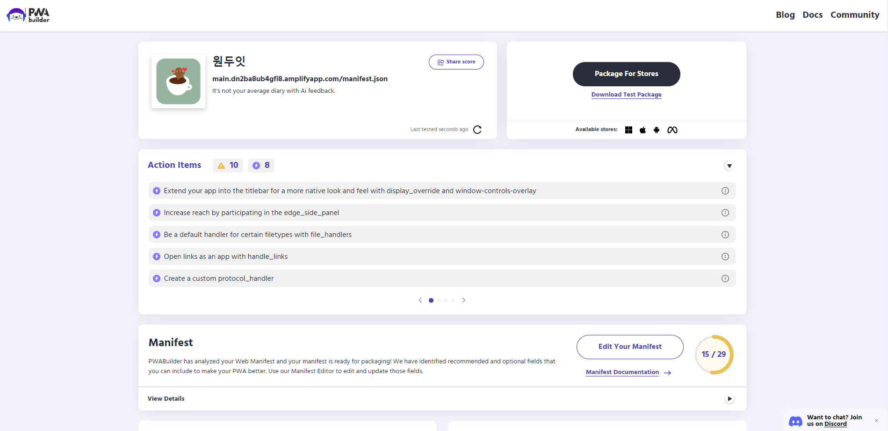
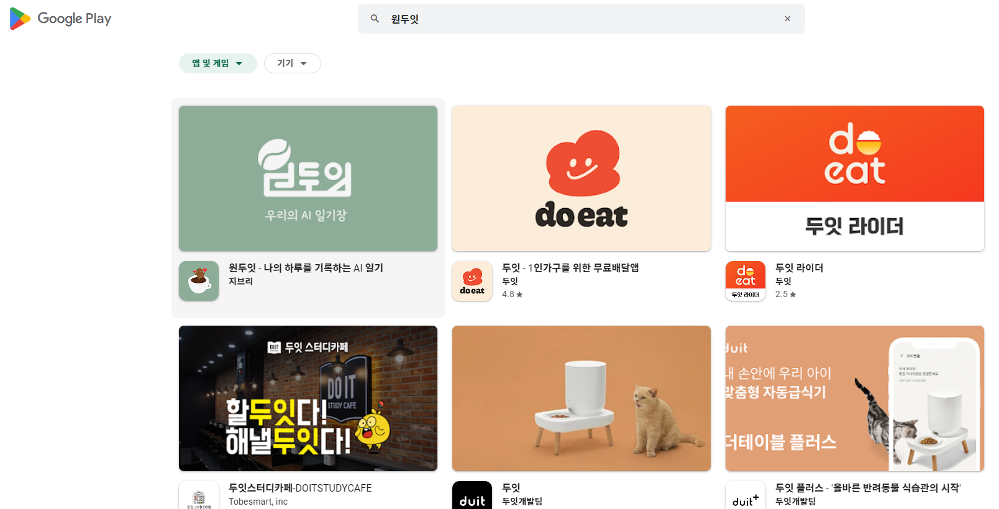
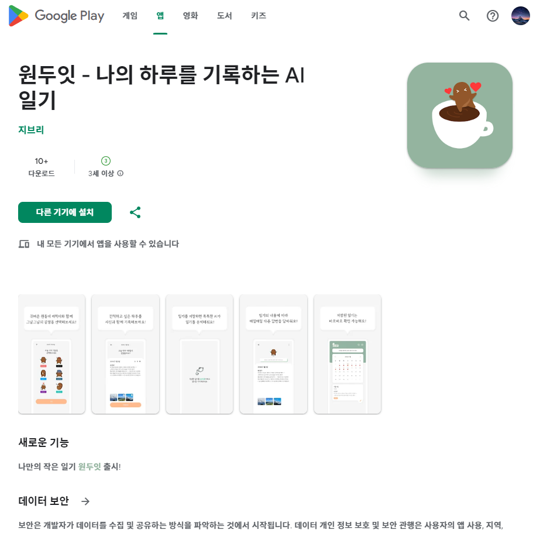

_2023.04 ~ 2024.03_

글또 10기 활동을 시작하며, 6개월 전에 마무리 한 1년동안 진행한 사이드 프로젝트의 회고를 늦게나마 작성하게 되었습니다. 이 글을 통해 프로젝트를 진행 과정과 문제들, 그리고 마무리까지의 과정을 정리하고자 합니다.

앞으로의 활동 기간 6개월 동안 빠짐없이 글을 작성하는 것을 목표로 하겠습니다.
이 글을 빌어 글의 시작을 도와주신 글또 운영진 분들께 감사 인사를 드립니다. (\_ \_)


## 목차

1. 프로젝트 시작
2. 기술 스택
3. 개발
4. 마무리

## 1. 프로젝트 시작

사이드 프로젝트를 해야겠다는 다짐과 함께 지내던 중, 친한 지인으로부터 AI 엔지니어로 직무 변경을 하게 되었다는 소식을 듣고, AI와 관련된 프로젝트를 진행해보면 좋겠다는 생각에 바로 연락을 하고 시작하게 되었습니다. 이 때는 왠지 ChatGPT 정도 수준의 모델을 투입할 수 있을 것이라 생각하며(복선) 지인과 함께 아이디어를 나누었습니다. AI 활용의 큰 기대감과 함께, 무엇을 만들어야 할지에 대한 고민이 시작되었습니다. 그러던 중, 실생활에서 자주 사용하는 일기장에 AI 피드백 기능을 탑재하면 어떨까라는 아이디어가 떠올랐습니다. 그렇게 결정된 프로젝트의 서비스는 '평범한 일기장에 AI 피드백 기능을 탑재한 평범하지 않은 프로그레시브 웹 서비스'였습니다.

<div style="display: flex; gap: 20px; overflow-x: auto">
    
    
    
    
</div>

프로젝트의 취지는 재미, 성장 두 가지를 담고 구성원을 모집했습니다. 사내에서 열의가 넘치는 백엔드, 기획자 분들을 섭외할 수 있었는데, 백엔드님은 신입이셔서 성장을 목표로 하셨고, 기획자님은 기획보다 디자인에 관심이 많아 재미를 목표삼아 디자인을 부탁드렸습니다. 기획은 전체적으로 협의하며 진행하기로 했습니다.(그렇게 디자이너님이 프레임까지 다 잡아주셨다고 하는데...)

웹 서비스이지만 실제 앱으로 출시해야겠다는 생각에 하이브리드 앱을 사용해아하나 생각하던 중, 네이티브에 리소스를 투입하기보다 웹을 메인으로 사용하고 한 번의 패키징으로 안드로이드와 iOS 두 OS에 배포가 가능한 장점이 있는 PWA를 사용하기로 결정했습니다.



<div id="caption">이미지를 ChatGPT로 생성했는데 로고와 서비스 매치가 이상하게 나왔네요...</div>
<!-- <figure align="center">
<figcaption style="color: gray;">이미지를 ChatGPT로 생성했는데 로고와 서비스 매치가 이상하게 나왔네요...</figcaption>
</figure> -->

아직 브라우저 별로 PWA 지원이 완벽하지 않기 때문에 레퍼런스가 부족하여 개발 중 여러 이슈가 생길 우려가 있고 네이티브 코드 하나도 없이 스토어 배포에 있어 확신이 없었으나, 실제로 적용 사례를 보면 스타벅스, 우버, 핀터레스트, 트리바고, 스포티파이, 알리익스프레스 등 안정적으로 운영 중인 서비스들이 있어 진행해도 괜찮다고 생각했습니다. 이외에도 다양한 사례를 보시려면 [https://onilab.com/blog/20-progressive-web-apps-examples](https://onilab.com/blog/20-progressive-web-apps-examples) 를 참고해주세요.

## 2. 기술 스택

- Frontend: Next.js, TypeScript, Zustand, React-Query, Styled-Components, AWS Amplify
- Backend: Java, Spring Boot, MySQL, Redis, AWS EC2
- AI: Python, Flask, Hugging Face Transformers
- Collaboration: GitHub, Notion, Discord, KakaoTalk

프론트엔드와 협업 툴의 기술 선택 이유를 간단하게 나타낸다면 다음과 같습니다.

- Next.js: PWA 보일러 플레이트가 존재하여 사용

- TypeScript: 타입 안정성을 확보하여 개발 생산성을 높일 수 있어 사용

- Zustand: 달력 데이터를 전역 상태로 관리해야 하는데 가벼운 상태 관리 라이브러리가 필요하여 사용

- React-Query: 데이터를 가져오는 데 필요한 로직을 간단하게 작성할 수 있고, 캐싱, 리패칭 등을 쉽게 구현할 수 있어 사용

- Styled-Components: 컴포넌트 단위로 스타일을 커스터마이징할 수 있어 사용

- AWS Amplify: Next.js를 사용했기에 서버리스 아키텍처를 사용하여 배포를 쉽게 하기 위해 사용

- GitHub: 버전 관리를 위해 Organization 사용

- Notion: 일정 관리 및 문서 공유를 위해 사용

- Discord: 음성 채팅과 화면 공유가 가능하여 회의를 진행하며 메인 메신저로 사용

- KakaoTalk: 언제 어디서든 빠른 소통을 위한 서브 메신저로 사용

사실 위에 적은 이유들은 대체로 추상적인 이유이고, 실제로는 **NPM 패키지의 다운로드 수, GitHub Star 수, 개발자 커뮤니티의 피드백** 등을 통해 선택했습니다.

아래는 각 라이브러리의 트렌드를 나타낸 그래프입니다.



프로젝트 시작할 즈음인 2023년 4월 기준으로 보면 상태 관리 라이브러리 jotai, recoil, zustand 셋 중에서 Zustand의 다운로드 수가 압도하는 것을 볼 수 있습니다.

(Redux는 다운로드 수가 폭발적이지만... 사용하기에 러닝커브가 높아 제외했습니다.)



스타일 관련 라이브러리는 styled-components, emotion, tailwindcss 셋 중에서 styled-components가 가장 많은 다운로드 수를 보유하고 있습니다. 그런데 최근 트렌드를 보면 styled-components가 점점 죽고 tailwindcss가 가파르게 성장하고 있네요..! 확실히 라이브러리 생태계는 빠르게 변하는 것 같습니다.

각 라이브러리의 사용 후기나 문서만 보고 판단하기보다 좀 더 다양하게 사용해보고 비교해보는 것이 저한테 더 필요하다고 느꼈습니다. 물론 특정 라이브러리의 전문성은 떨어질 수 있지만, 각각의 특성을 이해해보면 쓰임은 대체로 비슷하기에 새로운 기술 적용에 대한 거부감을 줄일 수 있었습니다.

## 3. 개발

#### 잦은 회의



<div id="caption">
    노션으로 관리한 회의록. 3개월 간은 주 2회, 이후에는 주 1회로 진행
</div>

프로젝트 초기에는 회의를 주 2회로 진행하며 기획, 디자인, 개발을 병행했습니다. 최소한의 기획만 잡혀있었기에 애자일하게 진행했으며, 중간중간 기획과 디자인이 바뀌는 경우가 많았습니다. 매 회의마다 피처를 한 명이 정하는 것이 아닌 팀원 협의하에 픽스하고 개발을 진행하다보니 정규 회의 시간은 1시간이었으나 30분에서 1시간이 추가되는 경우가 많았습니다. (이 때 제 욕심을 줄였으면...)

#### ESLint, Jest

지금보니 프로젝트 세팅하면서 ESLint를 적용하지 않았네요. 아마 제 생각엔 프론트 개발 협업 팀원이 없어서 Prettier만 적용했던 것 같은데, 다음엔 코드 품질을 위해 혼자서라도 ESLint를 적용해야겠습니다.
또한, 테스트 코드도 기존에 경험이 없어서 개발 기간 딜레이를 우려하여 적용하지 않았는데, 최근에 만든 웹 사이트에 Jest를 이용한 테스트 코드를 적용해보니 모듈에서 발생한 홀을 줄이는 좋은 경험을 했습니다. 글또 활동 기간 중에 테스트 코드 공부를 하고 관련하여 글도 써보면 좋을 것 같습니다.

#### Next.js 13 마이그레이션

1년 6개월 전인 2023년 4월에 Next.js의 stable 버전이 12였고, 13은 App Router가 베타로 프로덕션에서 문제가 생길 수 있다 하여 추후 마이그레이션을 고려하여 12 버전를 사용했습니다. ~~회사 프로젝트에서도 Next.js의 Page Router를 사용하고 있어서 세팅은 어렵지 않게 진행했습니다.~~ 처음 다루어 보는 PWA를 편하게 구현하기 위해 `create-next-app`를 사용하지 않고, 보일러 플레이트인 [next-pwa](https://github.com/shadowwalker/next-pwa)를 사용했습니다. Next.js의 기본 설정을 변경하지 않고 PWA를 적용할 수 있고, 예제나 Manifest 세팅 가이드가 잘 되어 있어 편하게 적용할 수 있었습니다. 만약 PWA와 Next.js를 함께 사용한다면 next-pwa를 사용해보시길 추천드리고 싶으나.. 2년동안 업데이트가 없어서 가이드 정도만 참고하고 직접 세팅하는 것도 방법일 것 같습니다.

1차 스펙의 마무리 단계인 API 연동을 진행하기 앞서, 웹 서버의 API 핸들러를 구현해야함을 보고 Next.js 13의 공식문서를 확인하여 어떻게 관리하는지 확인했습니다. 혹시라도 12 버전에 맞게 핸들러를 구현하다가 13에서 호환이 안될 수도 있기 때문에 말이죠. 13에서는 API Routes를 사용하면 API 함수명을 REST API 메소드명에 맞게 세팅해주면 내부적으로 알아서 핸들링되어 핸들러에 리소스를 쓰지않아 편리했습니다. 아래와 같이 말이죠.

```typescript
// src/app/api/diary/route.ts

import { NextRequest, NextResponse } from 'next/server';

export async function GET(request: NextRequest) {
  try {
    const req = await request.json();
    // const res = await axios.get()

    return NextResponse.json(res.data);
  } catch (error) {
    // error handling
  }
}

export async function POST(request: NextRequest) {
  try {
    // const req = await request.json();
    // const res = await axios.post();

    return NextResponse.json(res.data);
  } catch (error) {
    // error handling
  }
}

// PUT, DELETE 등 다른 메서드도 추가 가능
```

또한, 2023년 5월 4일날에 Next.js 13.4 버전이 stable로 릴리즈되어 App Router 적용에도 무리가 없었습니다.

마이그레이션을 했을 때 얻을 수 있는 이점이 API 핸들링의 편의성과 웹 성능 향상인 점을 고려하면 하지 않을 이유가 없었는데요, 허나 1차 스펙에서의 API 연동 일정 내에 소화할 수 있는 시간은 아니었습니다. 그렇다고 이를 2차로 미루기엔 다른 기능들과의 의존성이 크기에, 회의 시간에 팀원들과 상의하여 결국 1차 스펙의 기간을 연장하고 마이그레이션을 진행하기로 결정했습니다.



<div id="caption">
    Next.js 13 마이그레이션 커밋 흔적 - 2023.07.11 ~ 2023.07.25
</div>

위 기간동안 진행한 작업의 커밋을 PR로 남겨두었어서 마이그레이션 변경내용을 확인해보니, 38개의 파일에서 총 2,000줄 이상의 코드 변경이 있었네요. :clap::clap:

결과적으로 Next.js 12 -> 13 마이그레이션을 통해 1차 스펙 기간은 딜레이되었지만, API 핸들러 구현에 소요될 시간과, 추후 진행할 옵티마이징 작업을 미리 했다라고 보면 되려 전체적인 개발 기간을 단축할 수 있었습니다.
<br />

#### PWA 적용기

PWA(Progressive Web App)는 웹과 앱의 장점을 결합한 기술로, 웹에서 앱과 같은 경험을 제공하는 기술입니다. PWA를 적용하면 사용자 경험을 향상시킬 수 있고, 앱을 다운로드할 필요 없이 웹에서 바로 사용할 수 있어 사용자의 진입 장벽을 낮출 수 있습니다. 또한, 오프라인에서도 사용할 수 있어 네트워크 환경이 좋지 않은 상황에서도 서비스를 이용할 수 있습니다.

더 자세히 들어가보면 PWA의 장점은 많지만, 그 중 제가 궁극적으로 사용한 이유는 웹 서비스를 개발하면서 앱 배포를 동시에 할 수 있기 때문이었습니다.
보통 앱 개발을 하기 위해서는 네이티브 개발을 하는 것이 일반적이고, 다른 방법으로 하이브리드 앱을 통해 웹뷰로 앱을 만들기도 합니다.
하지만 네이티브 개발은 웹 기술이 안들어가고, 하이브리드 앱은 OS별로 추가적인 네이티브 세팅을 해야합니다. 이렇게 처음 계획은 PWA로 시작하여 배포의 어려움이 생기면 하이브리드 앱으로 전환하는 방식으로 설정했습니다.
다행히 개발이 끝나고 배포를 하기위해 [PWABuilder](https://www.pwabuilder.com/)에서 제공하는 패키징 방식대로 천천히 진행하여 성공적으로 배포를 마쳤습니다.
이 과정이 그렇게 순탄하지는 않았는데요, 크롬 개발자도구에 있는 Lighthouse와 PWABuilder에서 제공하는 테스트를 통해 문제점을 찾아 해결해야 했습니다.


<div id="caption">
    PWABuilder에서 에러로 인한 패키징 실패
</div>



<div id="caption">
    PWABuilder에서 성공적으로 패키징 완료
</div>

위 사진은 PWABuilder 사이트에 호스팅된 웹의 URL을 입력하여 패키징을 시도한 결과입니다. 처음에는 원두잇이 아닌 감성일기 프로젝트로 시작했던 모습이네요. :sweat_smile:
첫 번째 사진의 가운데 보이는 액션 아이템에서 에러가 발생하여 패키징이 실패했습니다. 여기서 발생하는 에러는 대체로 Manifest 파일 설정 문제인 경우가 많았고, 이를 해결하면서 네이티브 앱 배포의 간접 체험을 하는듯한 느낌이었습니다.

현재 PWA는 아쉽게도 실제 사용자가 그렇게 많지 않아 관련 레퍼런스가 많이 부족하여 이슈 발생 시에 해결이 어려운 경우가 있었는데요, 이런 경우에는 [PWA 공식 문서](https://web.dev/progressive-web-apps/)를 참고하거나, [PWABuilder 디스코드](https://discord.com/invite/hXGv6HvtrK)에서 제공하는 정보를 참고하면 좋을 것 같습니다. PWABuilder 디스코드는 그래도 활성화가 되어있는 편이라, 매번 알림도 오고 이슈 공유도 잘 되있다보니 한 번은 이 곳을 통해 해결한 기억이 나네요.

이외에도 앱을 들어갔을 때 처음 노출되는 화면인 스플래시 스크린에도 크롬 브라우저에서는 정상적으로 뜨나, 삼성 인터넷 브라우저에서는 흰 화면으로 보이는 문제가 있었고, PWA의 핵심 기능을 담당하는 서비스 워커도 빌드를 위한 기본 세팅은 했으나, 실제로 필요로 한 기능을 제대로 적용하지는 못했습니다. 원래는 오픈 이후에 웹과 서비스 워커의 추가 작업을 진행하려 했으나, 여러 사정으로 인해 프로젝트가 오픈과 함께 금방 종료되어 버렸습니다.

만약 PWA 도입을 고민하고 계신다면, 서비스 워커를 이용하여 사용 가능한 네이티브의 기능이 꼭 필요한 경우에 도입하는 것을 권장드리고 싶습니다. 안드로이드 OS만 경험해 보았지만, iOS는 원래부터 브라우저 호환성의 악명이 높은 Safari 브라우저를 기본으로 사용 + iOS의 미흡한 지원으로 인해 모든 모바일 OS를 대응한다면 더욱 신중하게 도입해야 할 것 같습니다.

## 4. 마무리

#### 1년이란 목표를 두고 프로젝트를 진행하지 않았습니다.

각자의 성장, 재미를 위해 시작한 프로젝트로서 진행 도중 잡힌 세부 일정의 기간인 2주일 또는 1개월은 단순히 동기 부여를 위함이었습니다. 이게 하나씩 모여서 1년이나 지났네요.

저는 PM으로서 팀원들의 의견이 앱에 반영되어야 각자의 색깔이 더해져서 오너십을 갖고 더욱 완성도 있는 앱을 만들 수 있을 것이라 생각하여 각자의 주장을 존중하며 최대한 반영했습니다. 이전보다 더 집중도 있는 모습을 보여준 것 같아 뿌듯했지만, 처음 추구했던 가치들과 다르게 앱의 완성도에 대한 제 욕심이 점점 커지면서 때로는 팀원들에게 더욱 화이팅하자는 마음으로 잔소리를 하기도 했습니다. 그래서 진행 중이었을 때는 조금 조급한 마음도 있었는데, 돌이켜 보니 각자가 원한 바를 이루면서 자연스레 프로젝트가 마무리된 것이 아닌가 생각되네요.

#### 그래서 현재 앱은...?




구글 플레이스토어에 올라가 있습니다만..이제 내릴 예정입니다. 서버가 열려있지 않아 서비스가 불가능한 상태거든요. 처음 스토어에 올리고 "AI 일기" 검색어로 노출이 되었으면 하는 기대가 컸는데, "원두잇"으로 검색해야만 나오는 상황이라 참 아쉬웠던 기억이 있네요.

프로젝트를 더 이어나갈 수 있었지만 끝낸 이유는 프로젝트의 장기화로 인한 우선순위 변경과 AI 서버 비용 문제였습니다. 우선 사이드 프로젝트는 처음 시작하면 삶에 있어서 꽤 큰 우선순위를 가지게 됩니다. 그러나 시간이 지나면서 삶의 다른 부분들이 더 중요해지고, 프로젝트에 투자하는 시간이 줄어들게 됩니다. 또한, AI 서버도 처음에는 유저가 별로 없으니까 소수가 동시에 일기를 작성하여 AI 피드백을 받을 수 있을 정도라면 괜찮다고 생각하여 3명이서 스트레스 테스트를 진행하였는데 바로 문제가 발생했습니다. RTX4080으로 로컬에서 돌리던 AI 서버였지만, 한 명의 피드백을 받기에도 많게는 10초, 적게는 5초가 걸렸습니다. 이를 해결하기 위해 클라우드 서버 비용을 리서치하였지만, 부담스러운 금액으로 현실적인 판단을 하게 되었습니다.

#### 다음에는 이렇게 하면 더 좋을 것 같아요

- **프로젝트 기간을 정해두고 진행하기**
  - 4개월 또는 길어도 6개월
- **AI 기능은 메인이 아닌 서브로...**
  - AI 비용은 시간이 지날수록 나아지겠지만 아직은 시기상조
- **중간 회고를 비롯한 모임을 통해 관계 형성**
  - 1년간 오프라인 만남이 한 번도 없어서 그런지 처음과 끝의 관계가 똑같이 유지되고 커뮤니케이션이 편해지지 않음
