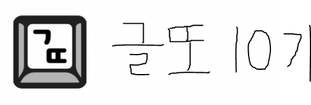

**2024-10 ~ 2025-03**

글또와 함께한 시간이 어느덧 6개월.

처음 참여했던 6개월 전부터 현재까지 그동안 경험한 커피챗을 위주로 나의 글또 10기 회고를 작성해보고자 한다.

### 목차

- [글또 10기 신청](#글또-10기-신청)
- [소모임 및 커피챗 후기](#소모임-및-커피챗-후기)
  - [첫 커피챗은 판교또](#첫-커피챗-판교또)
  - [냥또](#냥또)
  - [다진마늘](#다진마늘)
  - [데일리 크리에이또](#데일리-크리에이또)
  - [피크민또](#피크민또)
  - [일어났또](#일어났또)
  - [쓸만한 10분 모각글또](#쓸만한-10분-모각글또)
- [글 제출 현황](#글-제출-현황)
- [마무리](#마무리)

### 글또 10기 신청 

<u>2024년 9월 22일 일요일 오후 10시</u>에 나는 글또 10기 모집글을 보게 됐다.

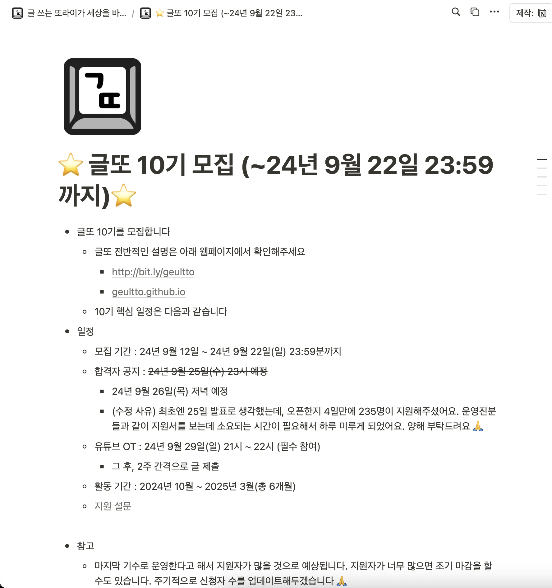

글또 10기 모집글

모집 기간이 24년 9월 22일까지였는데 운이 좋게도 마지막날 마감 2시간 전에 확인하여 신청서를 제출하였다..!

지원 양식에는 참여자가 얼마나 열심히 참여할 수 있는지에 대한 테스트를 하는 질문과 과제가 있었다.
어찌저찌해서 자정이 되기 5분 전이었나.. 가까스로 제출할 수 있었다!

내가 글또를 신청한 이유를 다시 생각해 본다면...

첫 번째로, **개발자 커뮤니티에 참여하여 여러 개발자들과 소통하고 싶었다.** 하지만 막연히 생각만 갖고 있었고, 개발자들과 만나는 것에 대한 두려움이 있었다.

공식적으로 커피챗 경험이 없어서 만나면 무슨 얘기를 할지,
기술적인 내용을 주고받을 때 모르는 부분이 있으면 안되겠지...뭐 이런 이유로 글또에 참여하기 전에는 다른 개발자와의 만남을 자처하지 않았다.

두 번째로, **네이버 블로그에서 개인 블로그로 넘어가기 위해서였다.**

개인 블로그를 Gatsby 라이브러리를 사용하여 직접 개발을 하고 있었는데 완성을 못한 상태이다보니 실제로 사용하고 있진 않았다. 회사 다니면서 작업을 하긴 했으나, 지속되는 막힘으로 중도에 멈춰선 상태였다.

글또 커뮤니티는 메인 활동이 블로그에 글을 쓰는 것이었기에 여기에 참여하면 반드시 내 블로그를 완성해내고 이 곳에 글을 제출할 것이라 믿었다. 그렇게 지금 탄생하게 된 것이 현재 블로그이다.

#### 글또 10기 합격

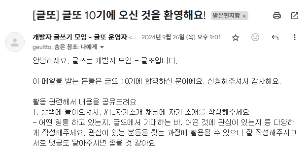

<u>2024년 9월 26일 월요일 오후 9시</u>에 이메일로 합격 알림이 왔다. 기쁜 마음으로 전달받은 슬랙 링크로 접속하고, 글또 10기를 시작하게 되었다.

### 소모임 및 커피챗 후기 

글또에는 여러 소모임들이 있다. 10기 시작과 동시에 처음에는 소모임이 왕성하게 생겨나기 시작했다. 소모임은 규율만 지키면 누구나 만들 수 있는 그룹으로, 각자 관심사에 맞는 사람들과 소통할 수 있는 기회를 제공한다.

일단 내가 참여하여 활동했었거나, 하고 있거나, 곧 진행할 소모임들을 나열해 보겠다. (순서는 ㄱㄷㄴ순)

- 강점검사또
- 냥또
- 넥스또
- 다진마늘
- 달리또
- 데일리 크리에이또
- 방통대수강해또
- 살기좋은안양또
- 수원또
- 쓸만한 10분 모각글또
- 왜요또
- 이력또
- 일어났또
- 판교또
- 피크민또
- 행사와또
- 히히 앱 만들어또

이렇게 총 20개의 소모임이 있었다. 이 중에서 내가 첫 커피챗을 하게 만들어준 소모임은 **판교또**이다.

#### 첫 커피챗은 판교또 

판교또는 판교에 사는 사람들, 또는 판교에 직장이 있는 사람들을 위한 소모임이다. 처음 소모임에 들어와서 자기소개를 하던 중에 내가 일하고 있는 서판교에서 또 일하는 분이 계셔서 바로 커피챗을 요청드렸다.

서판교에는 회사가 많이 없고 회사 생활하면서 주변 지리를 꿰놓은 상태여서 굉장히 가까울 거라 생각했었다. 그렇기에 커피챗 요청의 부담도 덜했던 것 같다.

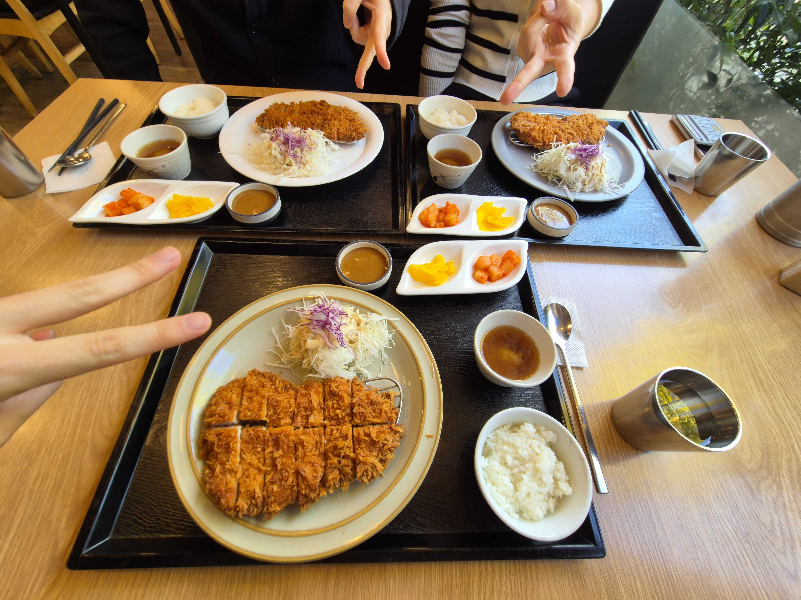

서판교 돈까스집

점심은 돈까스집으로 Fix하고 먹으면서 대화를 나누었다.

그런데 이게 웬걸? 내가 다니는 회사의 바로 옆 회사였다. 처음부터 회사를 서로 공개한 건 아니었고, 모이기로 한 장소가 점심시간에 충분히 만날 수 있는 장소여서 점심챗을 했는데 만나고 나서 알게 됐다.

난 정말 깜짝 놀랐고 세상과 업계가 좁다고 느꼈다. 무려 옆 회사에 글또 활동하는 두 분을 만났으니 말이다..ㅋㅋ

두 분 다 내 직무와 같은 프론트엔드로 일하고 계셨고, 그 덕분에 이야깃거리도 많았다. 오히려 점심 때 시간이 부족해서 그 다음 날에 연속으로 커피챗을 한 번 더 하게 됐다.

처음에 만나면 뭐라고 얘기해야 할지 생각이 안날 것 같아서 GPT한테 커피챗 질문 리스트를 뽑아달라고 했었다.ㅋㅋㅋ 도움이 됐는지는 잘 모르겠음..

여튼 각자의 고충과 일하는 방식, 기술적인 내용을 나누었고, 나만 다른 회사 사람이다보니 질문공세가 이어지긴 했지만... 끝난 이후에 첫 커피챗을 통해 깨달은 것이 있었다.

> 결국은 사람 대 사람의 이야기이다. 완벽할 필요없이 부담갖지 말고 편안하게 이야기를 나눌 수도 있는 것

처음 가졌던 부담과 두려움을 이렇게 첫 커피챗을 마치고 나서 조금이나마 해소할 수 있게 되었다.

#### 냥또 

냥또는 고양이를 키우는 집사와 고양이를 좋아하는 사람들이 모여있는 소모임이다. 나는 집에 냐옹이가 있어서 소모임이 생성되면 참여해야지 했는데 금방 생겨서 바로 참여했었다.

각각이 키우는 고양이, 고양이가 아닌 귀여운 동물 등... 다양하게 나를 힐링시켜 주는 사진들이 올라왔다.

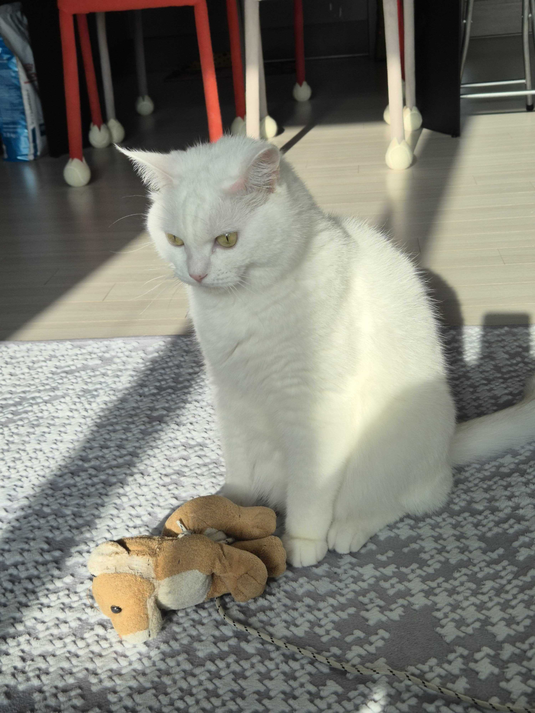

멍한 표정.. (가장 마지막에 올린 사진)

우리집 냥이 사진도 자랑하면서 귀여움을 공유했던 기억이 남는다. 또 중간중간에 냥또 소모임 채널을 만들어주신 4장님께서 이벤트도 열어주셔서 평소보다 사진을 더 열심히 찍기도 했었다.ㅋㅋㅋ
비록 콘테스트에서는 떨어졌지만 -\_-.. 보는 재미가 있고 마음이 힐링되는 소모임 중 하나이다.

#### 다진마늘 

다진마늘은 공유 스레드에 매일 투두를 세우고 목표를 달성하는 자기계발 소모임이다.

참여자가 많아서 그런지 리텐션율도 높다. 4장님이 관리 운영을 잘하시는 이유도 있을 것이다. 👍👍

실제로 월마다 목표를 노션에 올리는데, 들어가보면 지금까지 유저들의 참여 데이터를 기반으로 통계가 깔끔하게 구성되어 있다. 이게 데이터 전문가의 기술인가..하며 감탄했었다.

나는 뒤늦게 이 소모임에 참여하며 최근에 활동을 자주(?) 하는 편인데, 투두를 적어놓고 하나씩 달성해나가는 재미가 있다. 앞으로도 운영이 계속 된다면 더 참여하고 싶다.

#### 데일리 크리에이또 

데일리 크리에이또는 데일리 크리에이티브라는 책의 내용을 통해 하루 한 장의 에세이를 읽고 질문에 대한 답변을 공유하는 소모임이다.

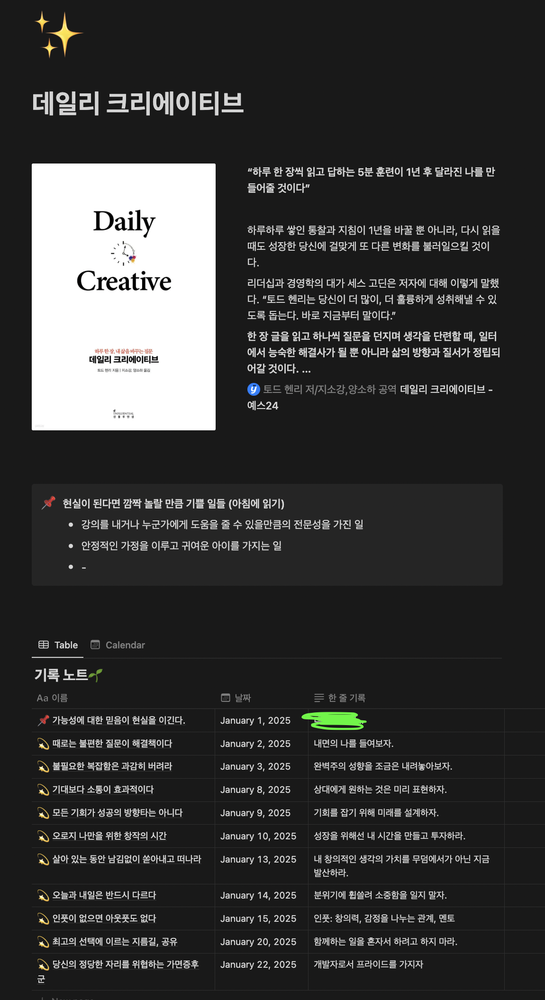

감사하게도 노션 탬플릿을 제공해 주셔서 위와 같이 질문에 대한 답변을 깔끔하게 작성할 수 있었다. 이 소모임은 1월부터 시작했는데, 보다시피 꾸준히 하지 못하고 1월 중도에 놔버렸다.ㅜ

해보면서 느낀건데 내가 하는 것도 물론 의미가 있지만, 다른 분들의 답변을 읽는 것도 굉장히 의미가 있었다. 나와는 다른 시각으로 바라보는 것에 대해 나만의 좁은 시야를 벗어나 다양한 관점에서 생각해볼 수 있는 기회가 되었다.

#### 피크민또 

피크민또는 피크민 블룸이라는 증강현실 모바일 게임을 즐기는(?) 소모임이다.

> 주제는 걷기를 즐겁게 하다로, 스마트폰을 들고 산책을 하는 것이 플레이의 핵심이다. 산책을 통해 피크민을 발견하고 육성하는 것으로 피크민 대열을 성장시킬 수 있으며, 걸어온 길에는 꽃이 자라나도록 하여 산책한 정도에 따라 환경이 변화하는 것을 경험할 수 있다. 날이 저물 때에는 하루 동안 걸어온 길과 걸음 수를 되돌아볼 수 있고, 텍스트와 사진 등을 첨부하여 기록을 저장하거나 공유할 수 있다.
출처: [피크민 블룸 - 나무위키](https://namu.wiki/w/Pikmin%20Bloom#s-1)

위의 설명에서 다뤘듯이, 걷기가 위주이다보니 산책을 같이하는 모임이 중간에 여러 번 있었으며, 직접 만나지 않더라도 온라인 상에서 교류할 수 있는 컨텐츠가 여러가지 있다.

그 것들을 함께 할 수 있도록 정보 제공, 그리고 더 나아가 슬랙 봇으로 자동화를 하여 이제는 매 주 진행하는 컨텐츠를 편리하게 진행할 수 있도록 해주셨다.

아 또 생각났는데 피크민은 단순 걷는 것에서 그치지 않고, 피크민을 데코하는 여러 카테고리들이 있는데 그들은 실제로 해당 카테고리가 존재하는 곳에서만 획득할 수 있다.

예시로, 피크민 블룸의 카테고리 중에 '미술관'이 있는데, 이 카테고리는 실제로 미술관에 가야만 획득할 수 있다. 그래서 미술관에 가는 경우도 있었고, 그 외에도 여러 카테고리들이 존재한다.

실제로 나도 주말에 수원 화성에서 모임을 한 적이 있는데, 나는 걷기보단 좋은 인연들과의 만남에 의의를 두고 갔었다. 가만히 있든, 걷든, 피크민을 하든 상관없이 그 날의 만남이 좋았기 때문이다.

피크민또 소모임을 참여한 이유는 하나의 엽서와 함께해보겠다.

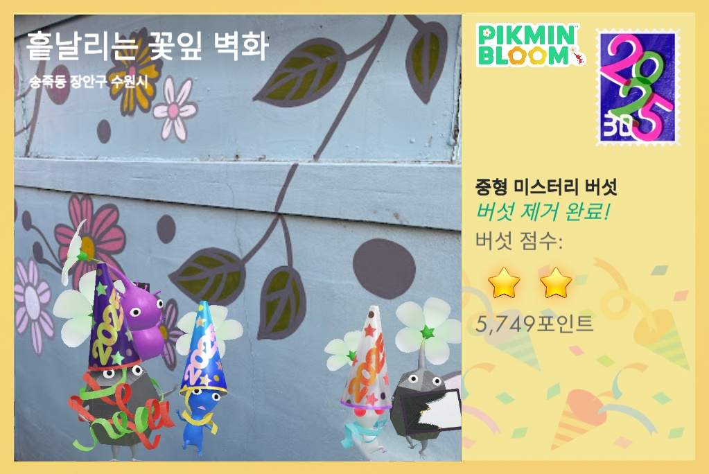

수원시 장안구 송죽동에서 내가 얻은 엽서

모바일 게임을 끊은 지 꽤 오래됐다. 여러가지 게임을 하다보면 주로 스트레스를 같이 받는 경우가 많았고, 그럴 바에야 차라리 게임을 하지 말자라는 생각이 들었다.

게임에서라도 스트레스를 해소하고 싶었는데 그런 게임은 마땅히 없었다. 사실 내가 찾아보지 않았다. 나에겐 유튜브 쇼츠라는 좋은 플랫폼이 있으니깐..

글또에서 때마침 피크민이라는 게임이 소개되어 봤는데 처음에는 재미없어 보였다. 엥? 이게 뭐하는 게임인지?

그렇게 별 생각없이 소모임에 들어가지 않고 있다가 이끌리게 된 계기가 있었다.

다른 소모임에서 온라인 모각글을 진행하던 도중, 갑자기 사람들이 피크민 엽서 대회(?)를 한다고 우루루 이동하게 됐다. 어떤 게임인가 궁금해서 나도 몰래 따라가게 되었다.

모임장님이 피크민 API를 활용하여 직접 만든 엽서왕을 겨루는 웹 사이트가 있었다. 이 정도의 정성을 가진 모임장님이라... 갑자기 재밌어보였다. 어느덧 피크민을 설치하고 있는 나, **그렇다 피며들은 것이다.**

그 이후로 피크민은 내게 힐링을 주는 게임으로 남아 지금도 하고있다. 덕분에 평소보다 더 걸을 수 있는 기회도 생기고 건강과 직결된 좋은 게임.

#### 일어났또 

일어났또는 매일 아침 본인이 선택한 시간인 6시, 7시, 8시에 일어나서 각자 일어났다는 인증을 하는 소모임이다.

채널의 채팅을 처음으로 올려보니 2024년 9월 30일에 생성과 동시에 참여를 했다. **글또 시작 이래에 처음 참여한 소모임이기도 하다.**

지난 초반부의 활동 내역을 보니, 처음에는 구글 밋을 통해서 인증을 했었다. 각 파트 타임별로 먼저 일어난 사람이 구글 밋 호스팅을 하고 채널에 링크를 공유하는 방식이었다.

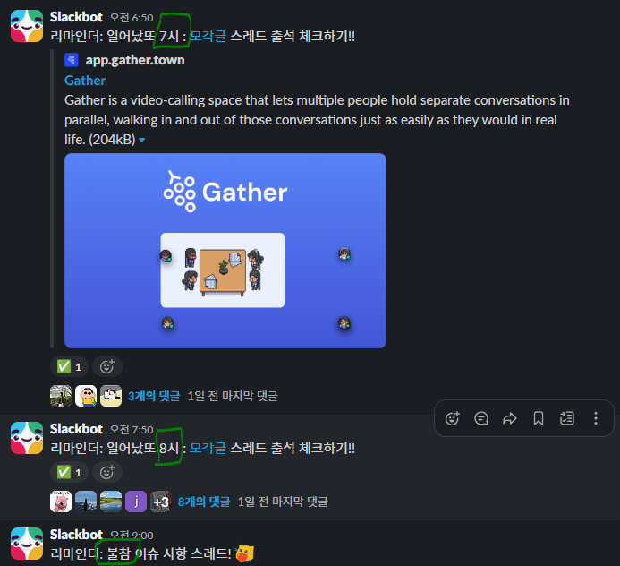

자동화된 지금

이전 사진은 없으나, 슬랙 봇을 통해 자동화된 지금과 비교하니 그때는 굉장히 번거로웠던 것 같다.ㅋㅋㅋ 확실히 서비스는 유저의 리텐션을 높이기 위해서라도 편리함을 제공해야 한다는 것을 느꼈다.(내가 하진 않았지만)

시간이 지날수록 인원이 증원됨에 따라 관리 리소스가 많이 발생하여 모임장님이 이것저것 많이 신경을 쓰셨다. 매일 참여자들의 인증 체크는 기본이고, 하룻밤이 지나기 전에 채널에 항상 격려의 글을 남겨주셨다.

이런 소소한 배려가 있었기에 지금까지도 리텐션율이 높은 것 같다. 나 또한 계속 참여 중!

그리고 주기마다 오프라인 모임 수요 조사를 통해 진행하는데, [모두의 시간](https://www.modutime.site)을 통해서 진행한다. 이 사이트는 내가 원하는 시간대에 맞춰서 다른 사람들과 조율할 수 있는 사이트이다.

위 사이트를 통해 커피챗도 몇 번 하면서 일어났또 인증을 통해 내적 친밀감을 쌓아온 분들을 만나볼 수 있었다.

수요 조사 추가해야 하는데.. 회사 스케줄 파악을 선행해야 하는ㅜ

#### 쓸만한 10분 모각글또 

쓸만한 10분 모각글또를 줄여서 '쓸모또'라고 부른다. 이 소모임은 글쓰는 것에 대한 부담감을 많이 내려놓고 매일 작은 글쓰기 성취를 느끼는 것을 목표로 하는 소모임이다.

이름은 10분 모각글이지만 풀타임은 21:00 ~ 22:00까지 진행된다. 매일 정해진 시간에 게더 타운에 모여서 각자 글을 쓰고, 끝나면 다 같이 회고를 하는 방식이다.

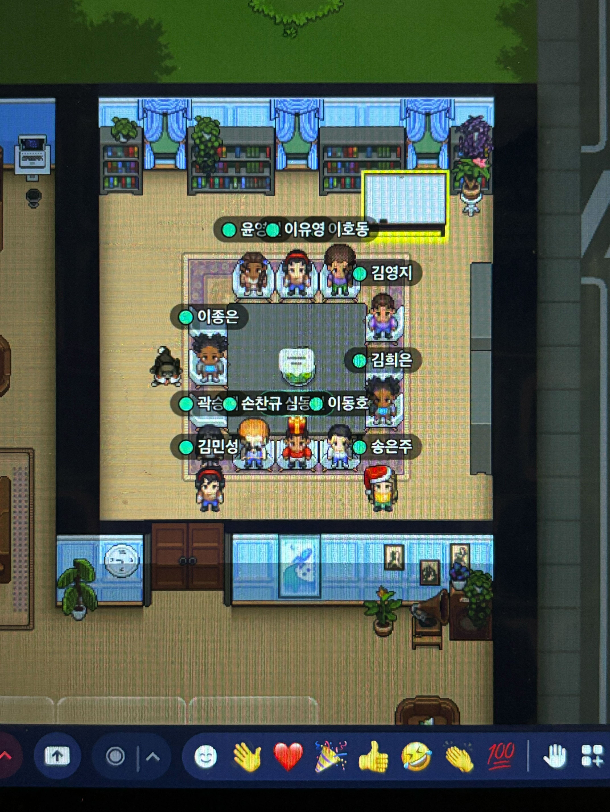

게더 타운에서 모여서 모각글을 하는 모습 (문제 시 삭제하겠습니다!)

위 사진은 지금보다 사람이 적었을 때의 사진인데, 최근에 또 접률이 좋지않아 내가 포함된 사진이 없다..

쓸모또는 글또 10기 시작인 1주기(?) 초반에 열렸는데, 나는 글 제출 2주기부터 글또가 끝나는 12주기까지 쭉 참여하게 되었다.

사람이 4~6명 있었던 시절부터.. 이제는 평균 10명이 넘고, 많게는 20명도 넘는 큰 규모의 소모임으로 커졌다. 나는 평소에 게더타운에서 모각공, 모각코 하는 것에 대해 관심이 있었는데 쓸모또가 내 니즈를 충족시켜 주었다.

그러나 평소에 늦게 퇴근하는 나에게는 21시라는 시간대의 참여가 쉽지 않었다. 2주기부터 12주기까지 쭉 참여했지만, 많게는 주 3회, 보통 평균적으로 주 1회 정도 참여했다.

야근 또는 개인 일정으로 주에 1회 참여하는 일이 있을 때마다, 스스로 아쉬운 마음과 죄송스러운 마음이 들었다. 모임장의 입장에서 생각했을 때, 즉 리더의 입장에서 섰을 때는 참여자의 의지가 꺾일 때의 마음이 얼마나 신경이 쓰이는지 알기 때문이다.

매번 주기가 끝나고 나오는 설문에는 이런 내 마음을 담아내고, 다음 주기에는 더 많은 참여를 하겠다고 다짐했지만... 결국 나아지지 않는 나의 상황으로 인해 그 다음 주기 설문에서 참여가 어려울 것 같다라고 말씀드렸었다.

그랬더니 돌아오는 모또짱의 은혜.
> 모또짱은 쓸모또의 모임장이신 4장님을 지칭하는 말이다.

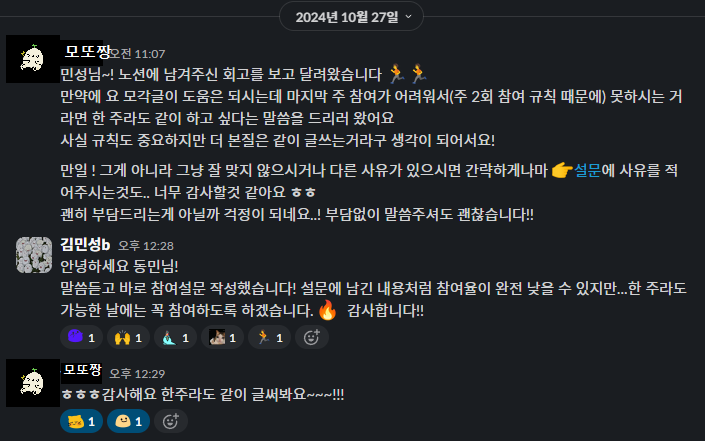

슬랙 DM으로 넘어온 온기

모또짱..!

너무나 따뜻한 말씀을 해주셔서 가슴으로 울면서 참여설문을 작성했었다.

내가 이렇게까지 쓸모또를 참여하고 싶었던 이유라고 한다면,

- 위 사진
- 게더 타운에서 동기 부여를 받으며 모각글을 할 수 있는 것
- 좋은 사람들과 따뜻한 회고 시간 << 이게 제일 컸던 것 같다.

노션으로 각자의 투두와 회고를 매번 정리하는데 회고에 달리는 댓글을 보면 얼마나 따뜻한지 모른다. 여기에 공개하고 싶지만 각자의 프라이버시를 위해 참아본다.

아직도 기억에 남는다. 야근으로 회사 일에 시달리며 차갑게 살던 나에게, 쓸모또의 회고를 통해 따뜻한 위로를 받았던.

그 뒤로 나도 누군가에게 따뜻한 말을 전하고 싶다는 마음이 생겼고, 참여할 때마다 가능하면 다른 분들의 노션 회고 글에 댓글을 달며 소통하곤 했다.

끝났지만 끝나지 않을? 앞으로도 계속 소통할 수 있기를...

#### 글 제출 현황 

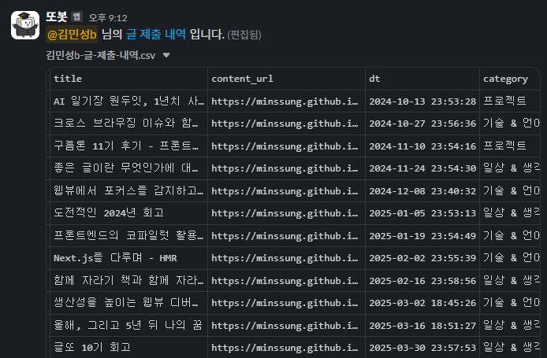

또봇이 알려주는 글 제출 내역

1주기부터 12주기까지 총 12개의 글을 제출했다.

처음에 글또를 시작하며 잡은 나만의 목표를 달성할 수 있었다. 12주기동안 패스권을 사용하지 않고 모두 제출하기.

#### 마무리 

글또 10기가 끝나고 나서도 계속해서 소통할 수 있는 기회가 생겼다.

11기가 이어지는 것은 아니고, 글또 활동의 매개체인 슬랙 채널의 유지 기간을 연장하여 글 제출도 지속적으로 할 수 있고, 커피챗도 주선하여 네트워킹을 할 수 있다. 슬슬 지금까지 모은 포인트를 활용할 수 있는 기회가 생길 것 같다.

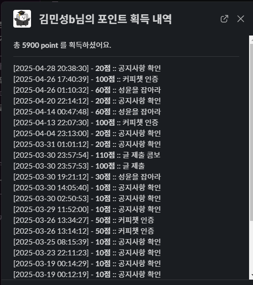

내가 지금까지 얻은 포인트는 이렇다. 회고 글을 나중에 수정하다보니 4월 내역도 포함되어 있는데, 이를 빼면 대략 5500포인트 정도가 된다.

지금은 10기가 끝난 기념(?)으로 글 제출 또는 활동할 때마다 받는 포인트도 2배 이벤트가 진행 중이어서 지금 글 제출하면 포인트 낭낭하게 받기 가능 (뭐가 나올지 궁금하다)

최근에는 여러모로 바빠서 글 제출이랑 활동을 잘 못하고 있는데, 내 일상을 지키면서 글또의 마지막도 함께 할 수 있기를 바라며 글을 마무리한다.