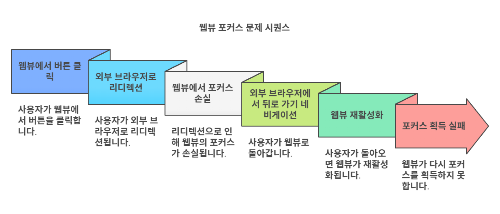
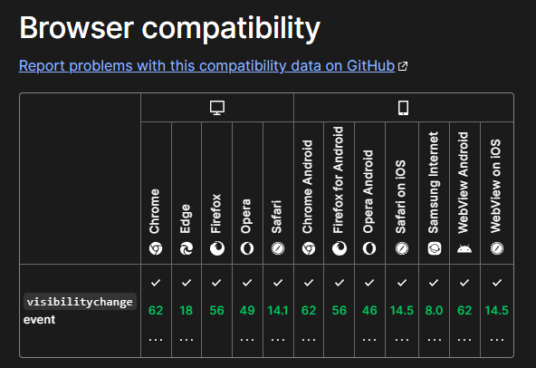
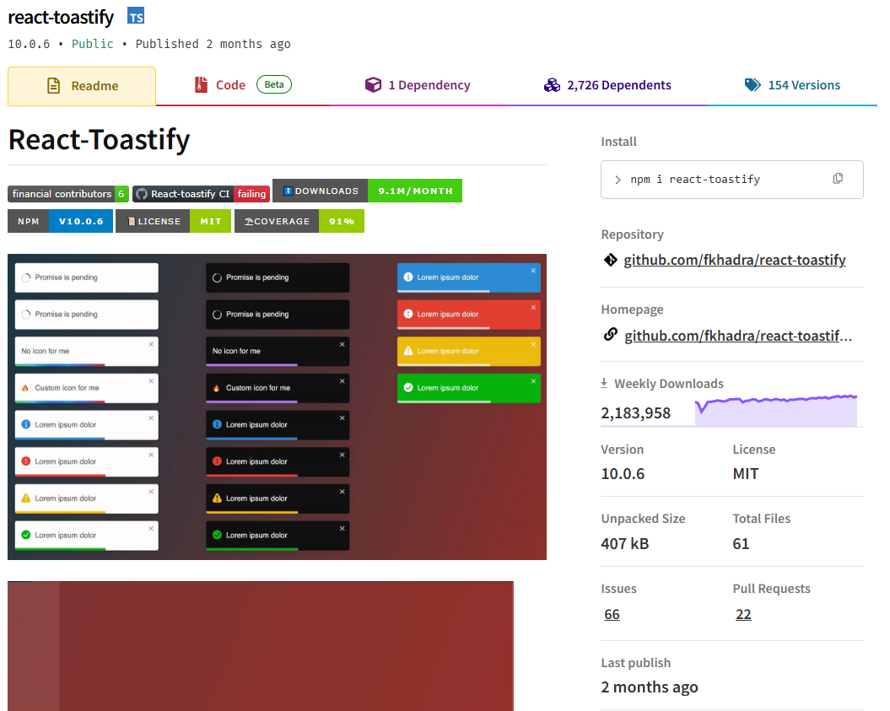
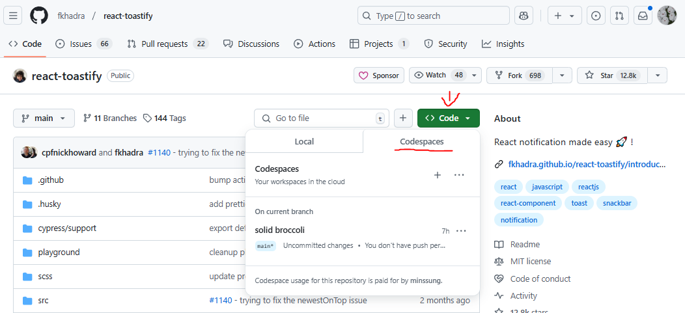
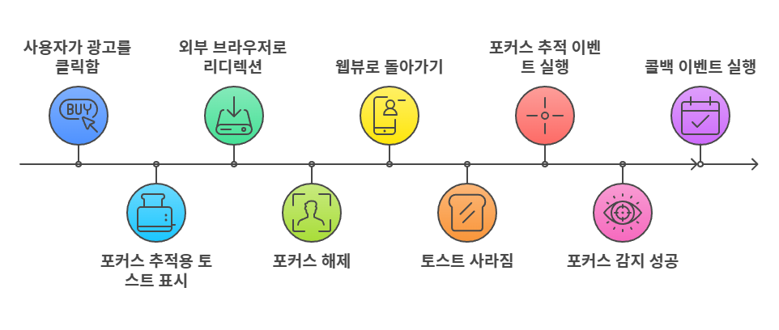

### 문제

웹 브라우저에서는 `focus`와 `blur` 이벤트를 통해 포커스를 감지할 수 있습니다. 안드로이드 웹뷰에서도 이런 이벤트를 사용할 수 있을까요? 웹뷰에서 포커스를 감지하기 위해 고민했던 이야기를 공유합니다.



웹뷰로 복귀한 뒤에 바로 포커스가 잡혀야 광고 페이지에 유저가 얼마나 머물렀는지 체크를 할 수 있는데, `focus`와 `blur` 이벤트 리스너같은 일반적인 방법을 사용해도 동작하지 않아 이건 R&D를 해야겠다는 필요성을 느꼈습니다. 우선 기본적으로 제공하는 **웹 이벤트와 API**를 살펴보기로 했습니다.

### 목차

- [해결을 시도하다1 - 웹 API 사용](#해결을-시도하다1)
- [해결을 시도하다2 - react-toastify 라이브러리 분석](#해결을-시도하다2)
- [해결을 시도하다3 - 네이티브 이벤트 활용](#해결을-시도하다3)
- [해결을 시도하다4 - react-toastify 활용](#해결을-시도하다4)
- [이 글을 쓰게 된 계기](#이-글을-쓰게-된-계기)

### 해결을 시도하다1 - 웹 API 사용 <a id="해결을-시도하다1"></a>

웹뷰의 포커스 감지를 해야 하는 일감을 회의에서 전달받자마자, “아, `visibilitychange` 웹 API를 사용하면 되겠네!”라고 말했더니 실장님이 하시는 말씀이 “그거 쓰면 안 돼. 구버전 브라우저는 지원되지 않는 기능이야.”였습니다. 아차 싶었던 저는 바로 **MDN**에서 해당 이벤트의 버전 호환성을 체크했습니다.


<div id="caption">오 이런</div>

크롬 브라우저는 62 버전부터 지원하여 2017년도에 릴리즈된 버전으로 그나마 양호하지만, 사파리 브라우저는 14.5 버전이 2021년도 릴리즈되어 호환이 안 되는 경우가 꽤 있을 것으로 생각했습니다.

과감히 다른 방식으로 해결해야겠다는 생각과 함께 몇 번 사용한 적이 있던 `focus` 웹 API로 눈을 돌렸습니다. `focus` 이벤트는 웹뷰가 아닌 웹 브라우저 기준으로 사용 경험이 있었기에 당연히 동작할 것으로 생각했습니다. 구버전에 대한 호환성 걱정도 없으니까요.

그런데 왠걸, `focus eventListener`를 등록하고 외부 브라우저 랜딩을 통해 웹뷰 바깥으로 포커스를 이동시켰다가 웹뷰로 다시 돌아왔을 때, 등록해 둔 핸들러가 동작하지 않았습니다.

혹시 잘못한 건가 싶어 웹 브라우저에서 확인해 봤으나 여기서는 문제없이 잘 동작했습니다. 웹 브라우저와 다르게 웹뷰는 제한된 기능을 가진 경량화된 브라우저이기에 이런 문제가 발생한 것 같습니다. `window.open()`을 통해 새 창을 띄우는 것도 웹뷰에서는 동작하지 않는 것처럼요.

이 외에도 모든 이벤트가 동작하지 않는지 의심이 들어 처음에 하려고 했던 `visibilitychange` 이벤트로 테스트해 봤더니 매우 잘 동작합니다.. focus, blur는 왜 동작하지 않는 걸까요?

웹뷰 밖으로 나갔다가 다시 돌아와서 한 번의 터치를 해줘야 focus가 잡히고 있습니다. 이처럼 한 번의 터치가 있어야만 focus가 잡히는 것으로는 문제를 해결할 수 없기에 또 다른 해결 방법을 찾기로 했습니다.

### 해결을 시도하다2 - react-toastify 라이브러리 분석 <a id="해결을-시도하다2"></a>


<div id="caption">https://www.npmjs.com/package/react-toastify</div>

토스트 UI를 사용하기 위해 설치하여 쓰고 있었던 `react-toastify` 라이브러리가 있습니다. 그런데 신기하게도 이 라이브러리에서 제공하는 토스트는 위와 같은 포커스 문제가 발생하지 않는 것이었습니다.

예시로, 토스트 노출 옵션에 `autoClose`를 3초로 걸어두고 다음과 같은 프로세스를 태웁니다.

1. 토스트 노출
2. 외부 랜딩으
3. 5초 뒤에 웹뷰로 복귀

제가 개발 중인 웹뷰 환경이라면 토스트는 3초 후에 비노출 처리되기 때문에 5초 뒤에 웹뷰로 복귀했을 때 이미 토스트가 보이지 않아야 하지만, 5초라는 시간이 지났음에도 토스트가 유지되다가 웹뷰로 돌아옴과 동시에 토스트가 화면상에서 사라지는 모습을 보여주고 있습니다.

이는 분명히 라이브러리 내부 로직으로 포커스를 감지하고 있을 것으로 생각했습니다. 그래서 오픈 소스를 제대로 분석해 본 적은 없지만 이번에는 조금 심도 있는 확인이 필요할 것이라는 생각에 깃허브 코드 스페이스를 통해 소스를 클라우드에서 가져와 확인했습니다.



`npm link`를 통해 프로젝트에서 사용 중인 `react-toastify` 대신, 코드 스페이스로 가져온 소스에서 코드를 수정하여 테스트할 수 있었습니다. 그나저나 소스 내부를 확인해 보니 역시.. 이해가 쉽지 않습니다.

콘솔 로그를 남겨 확인해 보면 좋을 것 같은 메소드들에 전부 로그를 추가하여 빌드 후, 링크를 통해 라이브러리를 연결하여 실제 프로젝트에서 테스트해 보았으나, 결정적인 단서를 찾지 못했습니다.(오픈 소스는 어렵네요.ㅜㅜ)

### 해결을 시도하다3 - 네이티브 이벤트 활용 <a id="해결을-시도하다3"></a>

피처 개발의 마감날이 다가와 여유롭게 오픈소스를 분석할 시간이 없었습니다. 빠르게 다른 방법을 생각했고, 웹에서 포커스를 감지하는 것이 아니라 네이티브에서 감지하고 이를 **브릿지 인터페이스**를 통해 전달해 주면 되지 않을까? 하는 생각이 들었습니다.

이러한 생각과 함께 바로 OS별 SDK 담당자분들께 필요한 기능에 관해 설명해 드리고 구현이 가능할지 확인을 요청했습니다. 다행히도 금방 가능하다고 말씀 주셔서 **웹과 SDK 간의 프로토콜**을 `onResume`으로 설정하여 구현이 완성되는 대로 테스트를 진행했습니다.

브릿지 통신은 이전부터 사용 중이어서 신규 인터페이스 추가는 빠르게 적용할 수 있었습니다. 테스트가 성공적으로 통과하고 기분 좋게 피처 개발을 완료했습니다만… 새로운 난관에 봉착하게 됩니다.


저는 신규 피처가 신규 앱에 들어가서 SDK의 업데이트가 진행된 경우에만 사용이 가능할 것으로 생각하고, 신규 브릿지 정의에 대해 별걱정을 하지 않은채로 진행했지만, 이미 운영 중인 일부 앱의 경우에는 현 SDK 버전에서도 동작할 수 있어야 한다는 소식을 들었습니다.

'아.. 이 방식은 철회해야겠구나..'하는 좌절과 함께 이제는 진짜 시간이 없어 빠르게 머리를 굴리게 됩니다.

‘오..!’ 하고 문득 떠오른 아이디어가 저를 구원해 주었으며, ‘이대로 하면 무조건 해결은 가능하겠다!’라고 확신하게 됩니다.

### 해결을 시도하다4 - react-toastify 활용 <a id="해결을-시도하다4"></a>

또다시 `react-toastify` 라이브러리로 넘어옵니다. 이 라이브러리는 이미 이 문제를 해결한 상태입니다. 그렇다면? 토스트 UI를 활용하면 될 것입니다.

포커스 감지가 필요한 시점에 포커스 추적용 토스트를 노출하고, 외부 브라우저 랜딩으로 포커스를 잃었다가 다시 웹뷰로 돌아오는 타이밍에 토스트가 비노출 처리되기 때문에 이 시점을 체크하기만 하면 됩니다.

최종적으로 제가 구현한 프로세스는 다음과 같습니다.



1. 광고 클릭
2. 화면상에 보이지 않는 포커스 추적용 토스트 노출
3. 외부 브라우저 랜딩
4. 포커스 해제
5. 다시 웹뷰로 복귀
6. 포커스 추적용 토스트가 사라짐 (`react-toastify`님 이 기능 어떻게 구현합니까..?)
7. 토스트가 사라졌을 때, 폴링을 활용한 포커스 추적 이벤트 실행
8. 포커스 감지 성공
9. `onClose` 콜백 이벤트 실행

포커스 추적 이벤트는 **커스텀 훅**으로 만들어, 해당 기능이 필요한 컴포넌트에 `onClose` 콜백만 받아서 처리가 가능하도록 구현했습니다.

```tsx
// 훅을 사용하는 컴포넌트 예시
import { useEffect } from 'react';
import { useFocusTracking } from '@hooks/useFocusTracking';

export default () => {
  const { startTracking, dismissTracking } = useFocusTracking();

  useEffect(() => {
    startTracking({
      onClose: () => {
        console.log('포커스 감지 성공');
      },
    });
    return () => {
      dismissTracking();
    };
  }, []);
};
```

이렇게 되면 커스텀 훅으로부터 추적 시작과 추적 중지에 대한 메소드만 받아서 처리하면 됩니다.

비록, 외부 라이브러리의 의존성을 가지고 있긴 하지만 최근에도 업데이트하고 있는 안정성이 어느 정도 보장된 라이브러리이기 때문에 상용화에 문제가 없다고 판단했습니다. 그럼에도 가장 좋은 방법은 서드파티 라이브러리 의존성 없이 자체적으로 기능을 구현하여 해결하는 방법이라고 생각합니다.

관련 트러블슈팅 레퍼런스를 찾지 못하고, 오픈소스에 대한 분석이 아직은 부족하여 만족스러운 해결을 하진 못했지만, 오픈소스 접근에 대한 두려움을 조금이나마 극복할 수 있었던 경험이었습니다.

### 이 글을 쓰게 된 계기 <a id="이-글을-쓰게-된-계기"></a>

웹뷰에서 포커스를 감지하는 기능을 추가하기 위해 R&D했던 내용을 글로 풀어냄으로써 해결 방법에 대해 다시 한 번 생각할 수 있었고, 이와 같은 문제를 겪는 다른 이들에게 도움이 되었으면 좋겠다는 생각으로 작성하게 되었습니다.

돌이켜 보면서 새로운 정답을 다시 고민해 보는 기회가 되고, 이 글을 읽는 분들 중에 `react-toastify`처럼 순수 자바스크립트 코드로 해결하신 분이 계신다면 관련하여 인사이트를 들을 수 있으면 좋겠네요!
