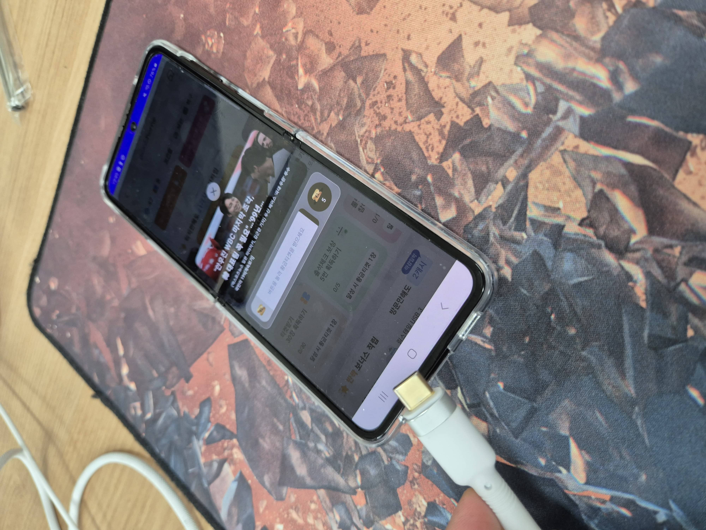
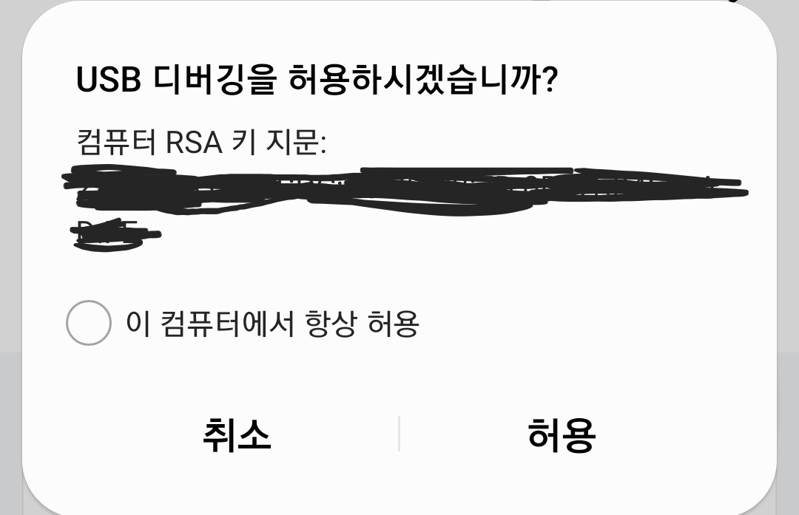
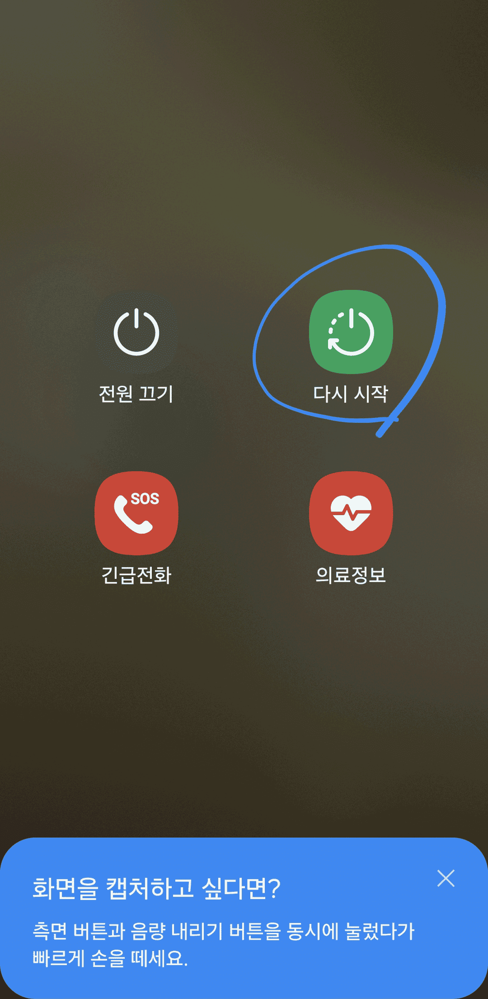
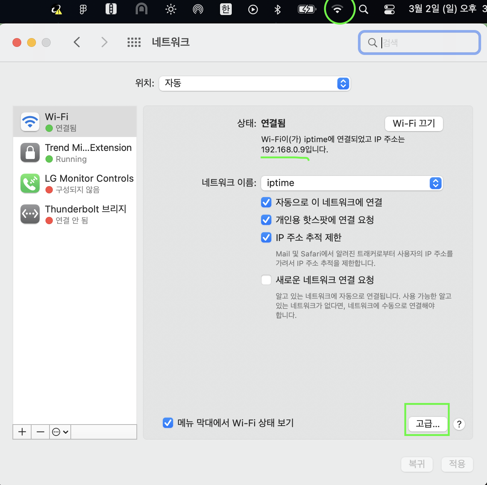
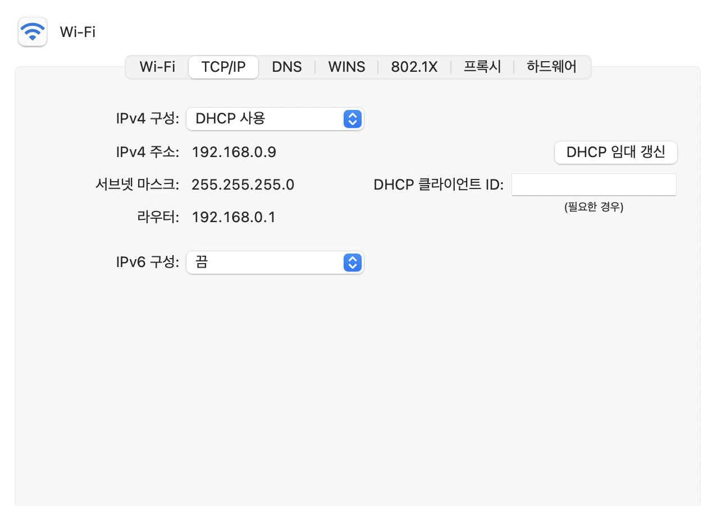
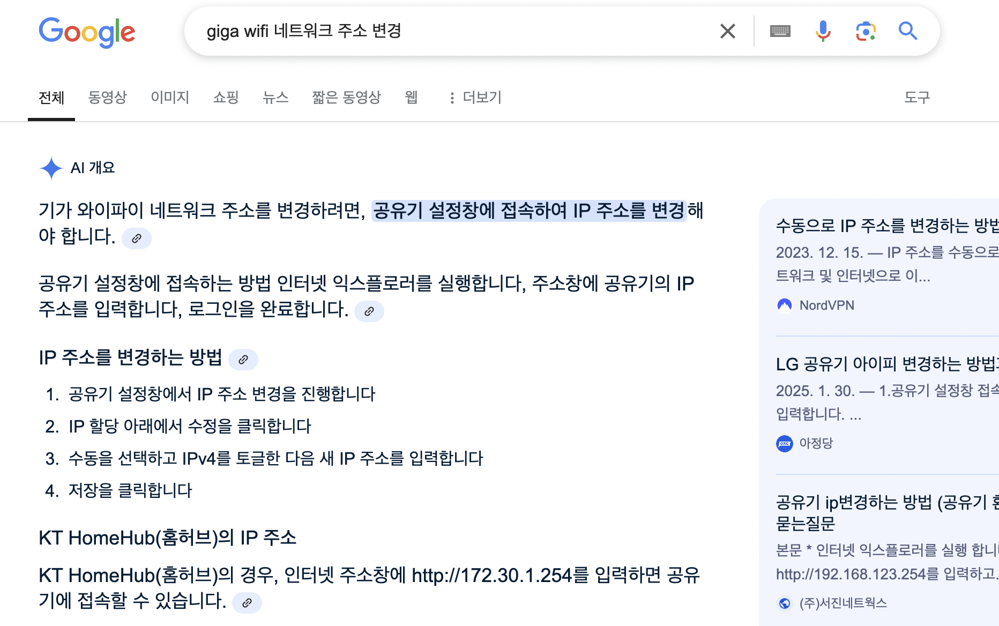

### 시작에 앞서

안드로이드 웹뷰(Android WebView) 개발 시 발생하는 디버깅 이슈와 그 해결 방법을 공유합니다. **크롬 인스펙터를 활용한 디버깅**, **무선 디버깅 설정**, 그리고 **로컬 개발 환경 구성**에 대해 실무에서 겪은 경험을 바탕으로 설명합니다.

<u>개발자 모드 ON과 같은 세팅은 다루지 않습니다.</u>

### 목차

- [크롬 인스펙터를 이용한 디버깅](#크롬-인스펙터를-이용한-디버깅)
- [고질병과 처방약](#고질병과-처방약)
- [새로운 처방약](#새로운-처방약)
- [집에서도 편하게 디버깅](#집에서도-편하게-디버깅)

### 크롬 인스펙터를 이용한 디버깅 <a id="크롬-인스펙터를-이용한-디버깅"></a>

웹뷰 디버깅을 위해 AOS는 크롬 인스펙터를 사용합니다. 크롬 인스펙터는 크롬 브라우저에서 URL에 `chrome://inspect`로 접속하면 PC와 연결된 디바이스를 인식할 수 있습니다.

그럼, 크롬 디버깅 시의 고질병을 먼저 살펴보겠습니다.

### 고질병과 처방약 <a id="고질병과-처방약"></a>

AOS는 유선 디버깅 시, 연결이 자주 끊기고 안되는 경우가 여럿 발생합니다. 처음에 잘 되다가도 인스펙터 화면이 갑자기 멈춘다? 또는 콘솔 로그로 찍어둔 객체 데이터를 클릭했는데 JSON 표시가 안된다? 디버깅 하기 바쁜데..하면서 아래와 같은 처방을 해봅니다.



1. **케이블 뺐다 꽂기**

이 방법은 급할 때 주로 이용하는데요, 빠르게 콘솔 로그나 네트워크를 확인할 때 종종 사용합니다. 특히 디버깅 허용 시간을 30초 가량밖에 안 주기 때문에 타임어택을 해야하는 스릴이 있기도 하지요. 손이 빠르다면 매번 뺐다 꼽았다 하는 방법도 낫뱃..?



2. **USB 디버깅 재홟성화**

휴대폰 설정에 들어가서 개발자 옵션 → USB 디버깅 토글 버튼을 껐다가 다시 킵니다. 제법 효과가 있는 녀석입니다. 단, 홈 화면 → 설정 → 개발자 옵션까지 들어가야하는 수고스러움은 감수해야 하며, 이 역시 단기간에 다시 풀리는 경우가 있어 완벽한 조치는 아닌 것으로 보이네요.

> 개발자 옵션이 안 보이신다면 https://blog.naver.com/skomj/222984901460 요기를 참고해 주세요.



3. **휴대폰 다시 시작**

이 방법은 이전에 제가 하도 답답해서 회사 모바일 파트 선임께 물어보고 전수받은 비법입니다.

디버깅에 굶주렸던 제게 가히 신세계입니다. 대부분의 디버깅 문제들이 기기 리부트만 하면 깔끔하게 정상화됩니다.(~~바로 리부트 정상화~~) 대신 껐다 켜야하기 때문에 위 두 방법에 비해 시간이 제일 오래 걸리는 단점이 있어 여유있을 때 주로 사용하는 편입니다. 못해도 거의 20분은 버티는듯??

### 새로운 처방약 <a id="새로운-처방약"></a>

1. **크롬 인스펙터가 디바이스를 제대로 인식하지 못할 때,** 아래 명령어로 디버깅 서버를 껐다 다시 시작합니다. adb가 설치되어 있는 환경에서 터미널에 아래 명령어만 입력해주면 됩니다.

```bash
adb kill-server
adb start-server
```

2. <u>**무선 디버깅**</u>을 해봅니다. AOS는 안드로이드 스튜디오 없이 **adb** 설치만으로 무선으로 디버깅이 가능해요! 먼저 휴대폰에 설정 → 개발자 옵션으로 들어가서 스크롤을 조금만 내려보면 무선 디버깅 토글 버튼이 있습니다. 이 토글을 활성화해보면 다음과 같이 해당 네트워크에서 무선 디버깅을 허용할 거냐는 팝업이 뜹니다.

허용을 하고, 무선 디버깅 메뉴를 클릭해 상세화면으로 넘어가면 페어링 코드로 기기 페어링 버튼이 있어요. 그걸 클릭하면 Wi-Fi 페어링 코드와 IP 주소 및 포트가 등장하게 되는데, 이를 adb 명령어를 이용해 연결해야 합니다.

`sudo adb pair 192.168.0.x:3000` 를 입력하면 페어링 코드를 입력하라는 메시지가 나오는데 휴대폰에 보이는 그대로 입력해주면 끝입니다. (만약 password를 입력하라고 나오면 sudo 권한에 대한 mac 비밀번호를 입력해 주세요!)

```bash
# 무선 디버깅 연결 명령어
$ sudo adb pair {IP}:{PORT}
Enter pairing code: 123456
```

3. 무선 디버깅이 성공적으로 연결되었다면, `chrome://inspect`로 접속해보세요. 이제 무선으로 디버깅이 가능해집니다.

> **주의사항**: 무선 디버깅은 같은 네트워크 상에 있을 때만 가능합니다.

### 집에서도 편하게 디버깅 <a id="집에서도-편하게-디버깅"></a>

저는 주로 실무에서 웹뷰를 다루다보니 로컬 환경에서의 웹뷰 환경을 디버깅해야 하는 일이 많습니다. 그러다보니 **웹 서비스를 실제 배포된 라이브 환경의 URL이 아닌, 로컬 환경의 URL로 디버깅을 해야할 때가 많은데요,** 개발 서버에서 코드 변경을 했을 때 바로바로 반영되어 빠르게 개발이 가능합니다.

물론, 웹뷰에 들어가는 웹도 웹 브라우저에 들어가는 웹과 다르지 않아 브라우저 단에서 개발하면 되지 않냐?라는 의문이 생길 수 있습니다. 그러나 제가 지금 다루는 서비스는 **Native SDK에 의존성이 걸려있는 비즈니스들이 주로 있다보니 브라우저에서 테스트하기에는 한계**가 있습니다.

그래서 항상 SDK의 버전이 업데이트되면 모바일 파트에서 새로운 SDK의 버전과 함께 웹뷰의 시작 URL을 제 로컬 IP주소로 세팅을 요청드립니다. 여기까지는 좋은데, **회사 인터넷의 IP 주소를 사용하기 때문에 집에서 개발을 해야하는 일이 생길 때는(재택근무 등) 이렇게 빌드된 앱이 동작하지 않게 됩니다.**

그렇다면 집에 연결되어 있는 인터넷 IP로 또 다시 빌드를 해야하는데, 이 때마다 **매번 빌드를 해야하는 번거로움을 줄이기 위해 집의 IP 주소를 회사 IP와 동일하게 설정하는 방법을 택했습니다.** 이렇게 하면 회사에서 빌드한 앱이 집에서도 동작하기 때문에 빌드를 매번 새로 하지 않아도 되는 장점이 있습니다.



이렇게 설정하는 방법은 생각보다 간단합니다. 예시로 현재 사용 중인 IP 주소가 192.168.0.x라고 가정하겠습니다. Mac 기준으로, 상단에 있는 인터넷을 클릭하여 네트워크 환경설정에 들어갑니다.



여기서 고급에 들어가 TCP/IP 탭을 클릭하면 IPv4 구성, IPv4 주소, 라우터를 확인할 수 있는데요, 여기서 IPv4 주소를 회사에서 사용 중인 IP 주소로 변경해주면 됩니다.

그렇기 위해서는 IPv4 구성에 DHCP 사용을 수동으로 변경하고, IPv4 주소를 회사에서 사용 중인 IP 주소로 변경해주면 됩니다.

만약, 네트워크 주소가 회사와 집이 서로 다르다면... (회사는 192.168.0인데 집은 172.xx.x) 저도 이랬습니다! 이럴 때는 **집의 라우터 주소를 웹 URL에 입력하여 들어가 네트워크 주소를 변경해야 합니다.**



<div id="caption">KT GIGA Wifi 예시</div>

집에서 사용하는 인터넷의 모델명을 확인하고 이를 구글링 해보면 변경 방법이 자세하게 나옵니다.

이 방법을 사용하기 전에 재택근무일 때는 최대한 로컬 환경에서 웹뷰 디버깅을 안하는 방향으로 업무를 진행했었는데 적용하고 나니 이제는 부담이 전혀 없이 웹뷰 디버깅을 할 수 있게 되었습니다.

단, 한 가지 주의사항이 있는데 회사와 집이 아닌 카페, 도서관 등 다른 네트워크를 사용하는 경우에는 TCP/IP 설정을 다시 DHCP로 변경해주어야 하는점.. 카페가서 왜 나만 인터넷 안되나 했던 경험이 있네요. 꼭 수동으로 체크되어 있는지 확인해야 합니다.

---

#### 참고 자료

- https://devbirdfeet.tistory.com/314
